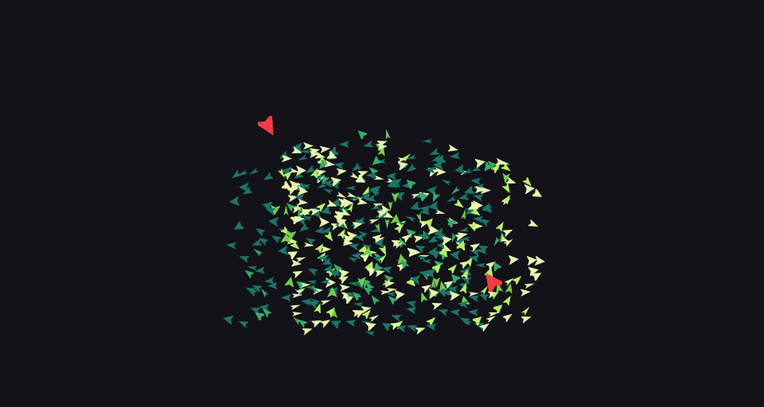
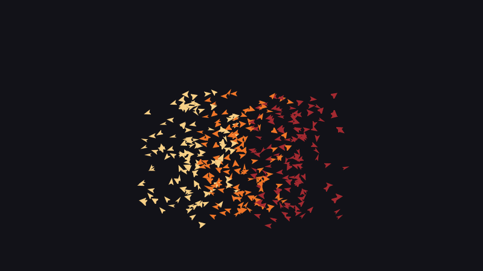
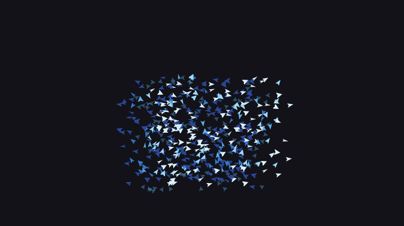
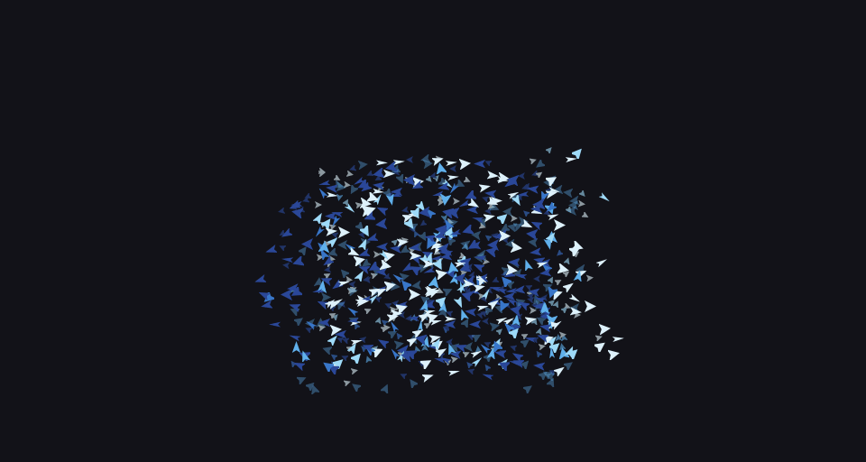
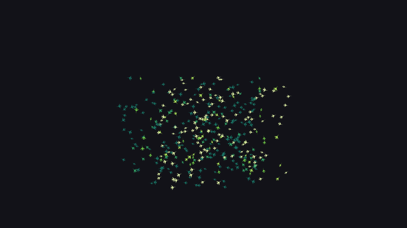
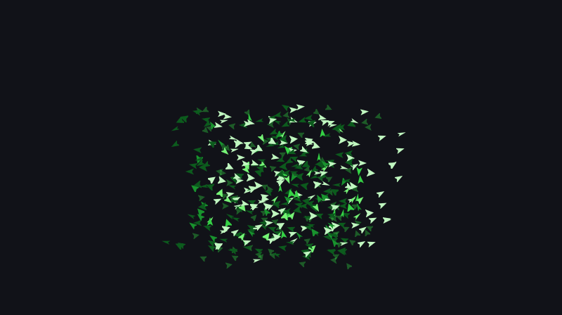
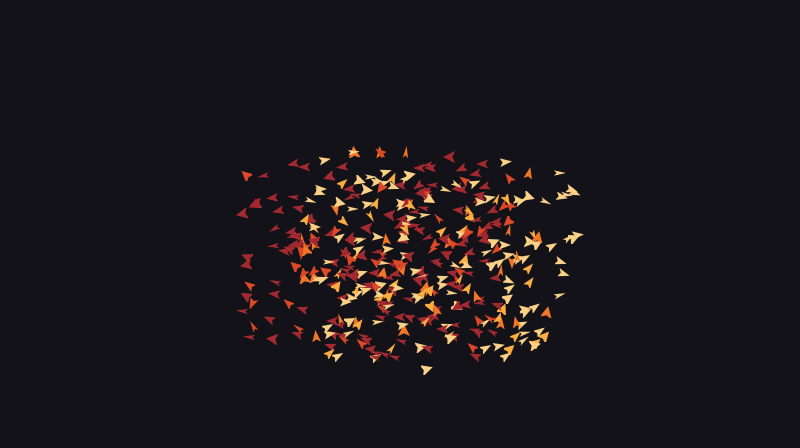
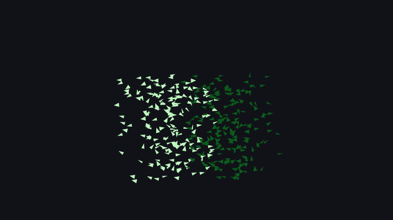
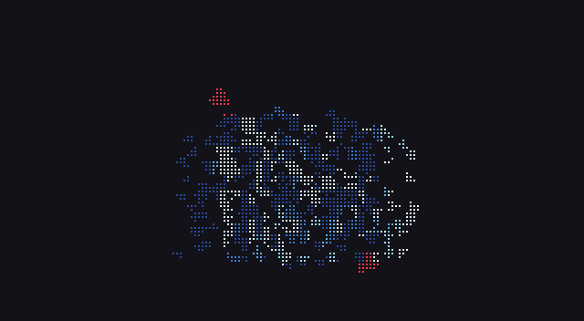
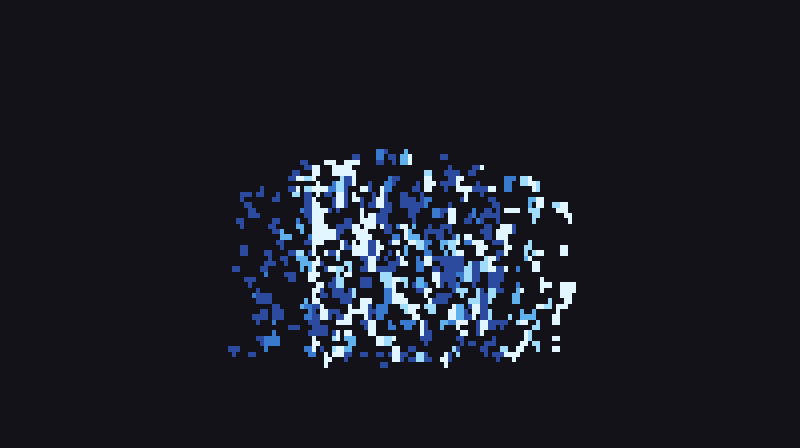

# cbirds

A flock of birds in your terminal.


Craig Reynolds' boids, drawn as sprites through the terminal's graphics
protocol, and as braille where there is none. One C99 program, no
dependencies. Every clip on this page was recorded by cbirds itself.

<table>
<tr>
<td width="50%"></td>
<td width="50%"></td>
</tr>
<tr>
<td align="center"><code>cbirds --hawks 2 --color acid</code></td>
<td align="center"><code>cbirds --flocks 3 --color ember</code></td>
</tr>
<tr>
<td width="50%"></td>
<td width="50%"></td>
</tr>
<tr>
<td align="center"><code>cbirds --preset murmuration --trails --color ice</code></td>
<td align="center"><code>cbirds --depth --trails --color ice</code></td>
</tr>
<tr>
<td width="50%"></td>
<td width="50%"></td>
</tr>
<tr>
<td align="center"><code>cbirds --preset storm --shape plane --color acid</code></td>
<td align="center"><code>cbirds --matrix</code></td>
</tr>
<tr>
<td width="50%"></td>
<td width="50%"></td>
</tr>
<tr>
<td align="center"><code>cbirds --color ember</code></td>
<td align="center"><code>cbirds --flocks 2 --shape arrow --color matrix</code></td>
</tr>
<tr>
<td width="50%"></td>
<td width="50%"></td>
</tr>
<tr>
<td align="center"><code>cbirds --render braille --hawks 2 --color ember</code></td>
<td align="center"><code>cbirds --render sextants --color ice</code></td>
</tr>
</table>

## Install

```
git clone https://github.com/clainstone/cbirds
cd cbirds
make
sudo make install
cbirds
```

Linux, macOS and the BSDs, or WSL inside Windows Terminal. You need
a C compiler and `make`, nothing else. `make test` runs the tests.

## Use

```
cbirds                              a flock, in your terminal's own colours
cbirds --preset murmuration         the starling look
cbirds --hawks 2 --color ember      something to watch
cbirds --flocks 3 --color ice       three flocks that keep to their own
cbirds --depth --trails             a second sky behind the first
cbirds --matrix                     it is raining birds
```

It opens by writing BOIDS, lets go, and flocks. Move the pointer into the
flock and it scatters. Press `q` and it flies off the top. Left alone for a
minute, it starts moving the sliders itself; any key takes them back.

The sliders are in the corner. Lowercase lowers, uppercase raises, one press is
one notch. `h` hides the panel.

```
╭────────────────────────────────────╮
│ boundary   ▓▓▓▓░░░░░░░░  0.20  b/B │
│ separation ▓▓▓▓░░░░░░░░ 0.005  s/S │
│ alignment  ▓▓▓▓░░░░░░░░  1.50  a/A │
│ turning    ▓▓▓▓▓▓▓▓░░░░   70°  t/T │
│ perception ▓▓▓▓▓▓░░░░░░  36px  p/P │
│ frame        0.6ms    31KB  60fps  │
│ quit       q                       │
╰────────────────────────────────────╯
```

| key | | key | |
|---|---|---|---|
| `b`/`B` `s`/`S` `a`/`A` `t`/`T` `p`/`P` | one notch down, one up | `h` | panel |
| `Space` | pause | `.` | one frame |
| `0` | back to the defaults | `Tab` | next preset |
| `+` `-` | more birds, fewer | `k` `K` | a hawk more, one fewer |
| `e` | tails | `q` | quit |

## Terminals

cbirds asks the terminal what it can draw and uses the best of it.

| terminal | what you see |
|---|---|
| Kitty, WezTerm, Ghostty, recent Konsole | sprites, over the Kitty graphics protocol |
| xterm, foot, mlterm, Contour, mintty, Windows Terminal | a picture a frame, in sixel |
| iTerm2 | a picture a frame, as an inline PNG |
| everything else: Alacritty, GNOME Terminal, Terminal.app, tmux | the same flock in braille |

`--render kitty|sixel|iterm|braille|sextants|blocks` overrides it.
Sextants are bolder than braille and need a font from 2020 or later; blocks
work everywhere. In text mode only the cells that changed are sent, and the
background is never painted, so the flock wears your theme.

If it draws nothing, or the wrong thing, in a terminal that is not in the
table, open an issue and say which terminal it is and what
`cbirds --render braille` does there. That is the report that helps most.

## Options

```
Flock
  -n, --birds COUNT             how many birds (default 800)
  -s, --size PIXELS             sprite size in pixels (default 15)
  -g, --flocks COUNT            flocks that keep to their own kind (default 1)
  -k, --hawks COUNT             predators hunting the flock (default 0)
      --preset NAME             murmuration, swarm, storm
      --seed N                  the same seed gives the same flock

Sliders   0 to 12, as the panel shows them
      --boundary NOTCH          how hard the edges push back (default 4)
      --separation NOTCH        how much a bird keeps its distance (default 4)
      --alignment NOTCH         how much a bird matches its neighbours (default 4)
      --turning NOTCH           sharpest turn a frame, 12 is instant (default 8)
      --perception PIXELS       how far a bird sees, 12 to 60 (default 36)

Look
  -c, --color RAMP              theme, ember, ice, acid, matrix
      --shape NAME              bird, arrow, plane, dot
      --sprite FILE             a PNG you supply, kept in its own colours
  -e, --trails                  faint tails behind the flock
      --depth                   a second sky further off: smaller, slower, dimmer birds
  -l, --no-panel                hide the sliders in the corner
      --render HOW              kitty, sixel, iterm, braille, sextants, blocks; auto asks

Oddities
      --matrix                  it is raining birds

Output
      --bench N                 run N frames with no terminal, print the numbers, quit
      --frames N                quit after N frames, for recording
      --snapshot FILE           write the last frame as a PNG
      --record FILE             record a GIF, or a .cast for asciinema, with no terminal, and quit
      --record-fps RATE         frames a second; a GIF can carry up to 50 (default 25)
      --record-seconds SECONDS  how long the recording runs (default 6)
      --record-size COLSxROWS   the size to record at, in cells (default 96x26)

General
  -h, --help                    the one-screen help
      --completion SHELL        completions for bash, zsh or fish
  -V, --version                 print the version and quit
```

That is `cbirds --help`, verbatim.

## Recording

```
cbirds --record flock.gif --hawks 2 --seed 5
cbirds --record flock.cast --record-fps 30
cbirds --snapshot frame.png --frames 400
```

`--record` needs no terminal: it runs the flock headless and writes the GIF
with its own encoder. If the file name ends in `.cast` you get an
[asciinema](https://asciinema.org) recording instead, which plays in any
terminal and is about half the size. With `--render braille` or
`--render sextants` the GIF is of the cells, as a text terminal would show
them. `--snapshot` saves a live frame as a PNG, so it wants a
terminal. The commands behind every clip here are in
[docs/README.md](docs/README.md).

## How it works

The bird is one PNG compiled into the binary. At startup it is rotated into
sixty headings, squashed into three wing positions, and tinted into every
shade on the ramp: about fifteen hundred small images, built in a fifth of a
second. Under Kitty they are uploaded once, and a frame is then one short
command per bird. Other terminals get the same pixels as a sixel or PNG
picture, or sampled down into braille, sextants or blocks. The wings beat six
times a second, and now and then a bird glides.

Neighbours are found with a grid, so eight hundred birds cost about half a
millisecond of CPU a frame, and four thousand birds about four milliseconds.
The PNG, GIF, DEFLATE and sixel code is all in the repository; there is no
zlib, no libpng, no ncurses. `cbirds --bench 300` prints the numbers on your
machine.

## The algorithm

Each bird looks at the birds within its perception radius and follows three
rules. With $p$ for position, $\theta$ for heading and $N$ for the neighbours
of bird $i$:

- **Separation**, away from the neighbours:
  $s = \sum_{j \in N} (p_i - p_j)$
- **Alignment**, the way they fly:
  $a = \frac{1}{|N|} \sum_{j \in N} (\cos\theta_j, \sin\theta_j)$
- **Cohesion**, towards their middle:
  $c = \frac{1}{|N|} \sum_{j \in N} p_j - p_i$

Add them up with weights, plus a push $b$ away from the edges of the screen,
and the direction of the sum is where the bird wants to go:

$$d = 0.005\,s + 1.5\,a + 0.01\,c + 0.2\,b, \qquad \theta^{*} = \mathrm{atan2}(d_y, d_x)$$

The weights are far apart because the terms are: $s$ and $c$ are in pixels,
$a$ is a unit vector. Three of the weights are the panel's sliders.

The bird does not snap to $\theta^{*}$. It turns towards it by at most a fixed
angle a frame, the turning slider, then flies a fixed distance. That limit is
what gives the flock curved fronts instead of a cloud that changes shape all
at once. Every bird reads the previous frame and writes the next, so the
order does not matter and a seed gives the same run every time.

The edges push harder the deeper a bird gets into a band along them. With
several flocks, separation still applies to every bird in range, but
alignment and cohesion only to a bird's own flock, which is why two flocks
pass through each other and come out as two. The hawk and the pointer are two
more pushes, stronger than the flocking and tuned so that neither can drive
the flock off the screen.

The hawk picks a bird, aims where it will be, and dives; only that bird counts
as a catch. The flock streams around the hawk and closes behind it. Under
`--depth` a third of the birds fly in a far plane, smaller and slower, and the
two planes never mix.

## Credits

The model is from Craig Reynolds' *Flocks, Herds, and Schools: A Distributed
Behavioral Model*, SIGGRAPH 1987; his page on boids is at
[red3d.com/cwr/boids](https://www.red3d.com/cwr/boids/). The Kitty graphics
protocol is documented at
[sw.kovidgoyal.net/kitty/graphics-protocol](https://sw.kovidgoyal.net/kitty/graphics-protocol/).

## License

MIT. See [LICENSE](LICENSE).
