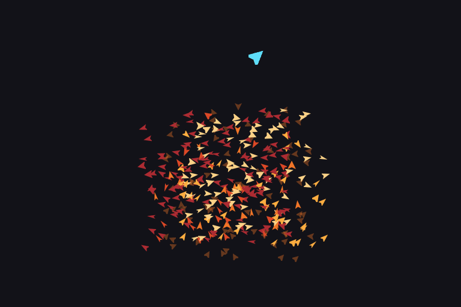
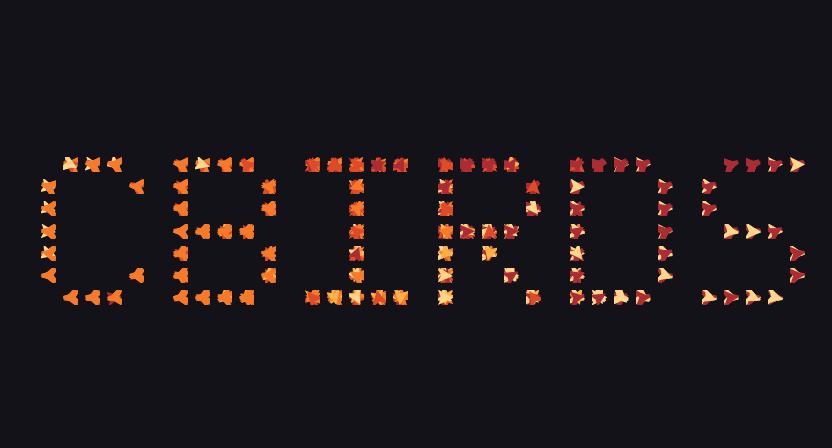
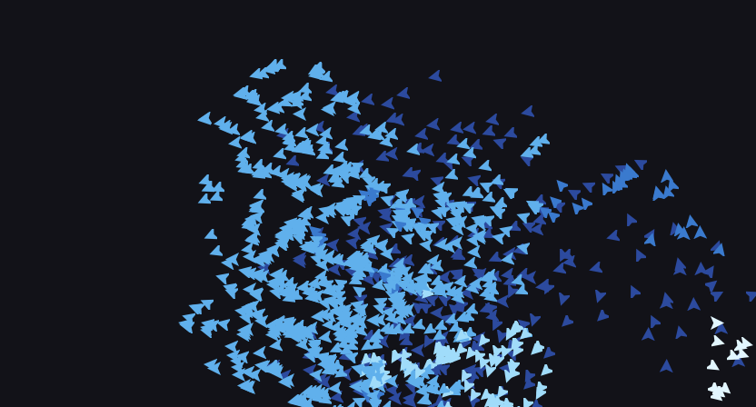
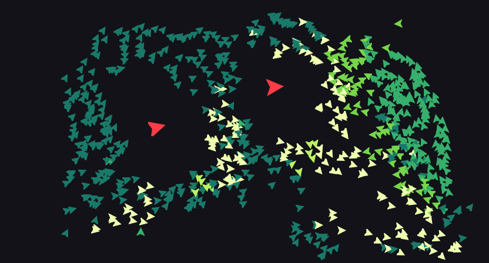
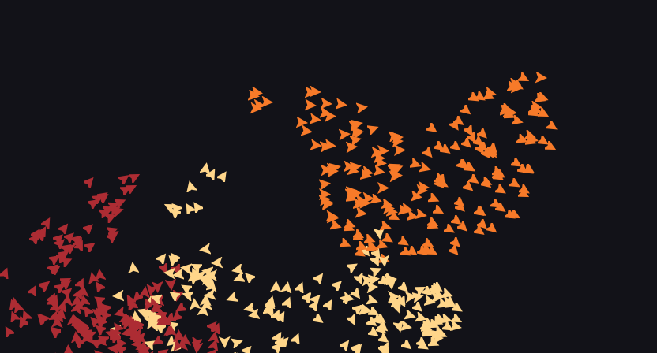
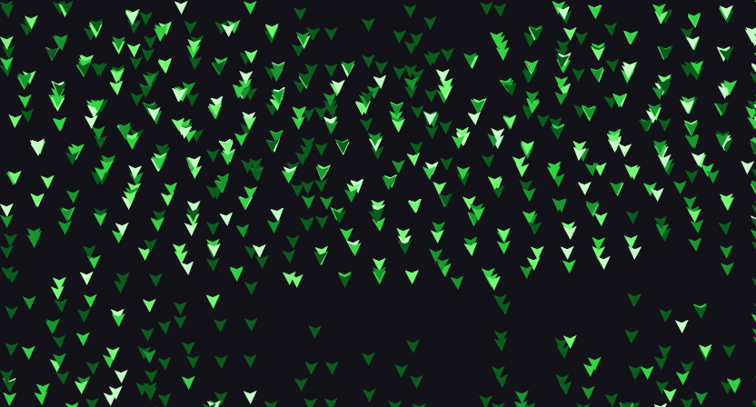

<div align="center">

# cbirds

**A flock of birds in your terminal.** Real sprites, real flocking, no dependencies.




*That is a terminal. Those are PNG sprites. It wrote its own name, and then
recorded this GIF of itself at 50 frames a second — the LZW encoder is in
`gif.c`, and one command regenerates it.*

</div>

## What this is

Craig Reynolds' boids, from 1986, rendered as rotated PNG sprites through the
Kitty graphics protocol. Eight hundred birds at sixty frames a second, in a
terminal, in about a third of a millisecond of CPU per frame.

There is no zlib, no libpng, no ncurses and no SDL. The PNG decoder, the PNG
encoder, the DEFLATE compressor *and* decompressor, the CRC and Adler checksums,
the rotation, the resampling and the 5×7 font are all in this repository, in
about 7,500 lines of C99 that link against libc and libm and nothing else. The bird is one PNG
compiled into the binary; every rotation and every colour of it is built at
startup, in memory, by the project's own code.

```bash
git clone https://github.com/clainstone/cbirds && cd cbirds && make && ./cbirds
```

## Try these

The flock writes whatever you pipe into it:

```bash
fortune | cbirds --spell -
echo "SHIP IT" | cbirds --spell -
```

It wears your terminal's own colours, because it asks:

```bash
cbirds                    # already does, that is the default
cbirds --color ember      # or pick a ramp
```

<div align="center"></div>

```bash
cbirds --preset murmuration --trails    # the starling look, with tails
cbirds --turning 2                      # long, lazy banking turns
cbirds --hawks 2                        # give the clip a story
cbirds --flocks 3 --color ice           # three flocks, each keeping to its own
cbirds --clock                          # the flock is the time
cbirds --screensaver                    # for a terminal left open
cbirds --matrix                         # it is raining birds
cbirds --shape fish --wrap              # or a school, off one edge and onto the other
```

<table>
<tr>
<td width="50%"></td>
<td width="50%"></td>
</tr>
<tr>
<td align="center"><code>--preset murmuration --trails</code></td>
<td align="center"><code>--hawks 2 --color acid</code></td>
</tr>
<tr>
<td width="50%"></td>
<td width="50%"></td>
</tr>
<tr>
<td align="center"><code>--flocks 3 --color ember</code></td>
<td align="center"><code>--matrix</code></td>
</tr>
</table>

And then move your mouse. The flock parts around the pointer.

## The panel

Every adjustable parameter is a slider in the corner, with its value and the two
keys that move it. Lowercase lowers, uppercase raises, and **one keypress is
exactly one notch of bar** — the notch is the state the keys move and the value
is derived from it, so the number and the bar cannot disagree.

```
╭────────────────────────────────────╮
│ boundary   ▓▓▓▓░░░░░░░░  0.20  b/B │
│ separation ▓▓▓▓░░░░░░░░ 0.005  s/S │
│ cohesion   ▓▓▓▓░░░░░░░░ 0.010  c/C │
│ alignment  ▓▓▓▓░░░░░░░░  1.50  a/A │
│ perception ▓▓▓▓▓▓░░░░░░  36px  p/P │
│ rate       ▓▓▓▓░░░░░░░░    60  r/R │
│                                    │
│ quit       q                       │
╰────────────────────────────────────╯
```

The flock cannot fly through it. The panel's rectangle carries an edge force of
100000, far above every other term in the model, aimed at whichever of its two
open sides is nearer — and the force acts on the panel grown by one frame of
travel, which is what makes it unreachable rather than merely unwelcoming. Over
**5.3 million placements across eight configurations** — every combination of the
turning limit's extremes and the frame rate's — not one landed on it.

| key | | key | |
|---|---|---|---|
| `b`/`B` `s`/`S` `c`/`C` `a`/`A` `p`/`P` `r`/`R` | one notch down / up | `h` | hide the panel |
| `space` | pause | `.` | one frame |
| `0` | back to the defaults | `Tab` | next preset |
| `+`/`-` | more or fewer birds | `k`/`K` | summon or dismiss a hawk |
| `e` | trails | `w` | wrap |
| `M` | cycle the pointer's mode | `L` | cycle what picks a colour |
| `q` | quit, with a fly-away | | |

There is also the Konami code. It is in `--help`, under **Oddities**, because an
easter egg nobody finds is wasted.

## Options

`cbirds -h` is one screen of the dozen that matter. `cbirds --help` is all
forty, grouped. Both come off the same table that drives the parser, so they
cannot drift apart, and `--completion bash|zsh|fish` walks it too.

It accepts what people actually type: `-n 800`, `-n800`, `--birds 800`,
`--birds=800`, clustered flags, `--no-NAME`, `--` to end the options. A typo is
answered with the name you probably meant. Usage errors exit 2, so a script can
tell a mistyped command from a run that went wrong.

```
$ cbirds --colour ember
cbirds: unknown option '--colour', did you mean '--color'?
Try 'cbirds --help'.
```

## How it works

**The sprite.** One PNG, compiled into the binary as a C array. At startup it is
decoded, scaled up 8×, then rotated into 90 frames at 4° apart and re-encoded as
90 PNGs in memory — 50 ms. Colour is a second set of images, because Kitty has
no per-placement tint; the rotation is the expensive half and does not depend on
the colour, so each angle is rotated **once** and then tinted and encoded per
shade. Five shades cost 35 ms, not 250.

**The protocol.** Each frame is one synchronized update (`CSI ? 2026 h`), one
global placement clear, one placement per bird, then the panel, then a
non-blocking flush that keeps only the unsent suffix if the terminal cannot
swallow it. The screen is **never** cleared after the sprites are uploaded:
clearing deletes them, and every later placement would point at an image that no
longer exists. A test asserts that no frame ever carries a screen erase.

**The recording.** `--record` runs headless — no terminal, no frame budget, and
deterministic given `--seed` — composites every frame into one canvas and writes
an animated GIF: global colour table chosen from the frames themselves, LZW,
Netscape looping. `--record-fps` and `--record-seconds` say what you want; fifty
a second is the ceiling, because a GIF's delay is whole hundredths and viewers
clamp anything under two of them. Ask for sixty and you get fifty, and it tells
you why instead of pretending. The demo at the top of this file is 300 frames at
50 fps, made by the command in `docs/README.md`, and nothing outside this
repository touched it. The test reads a recording back with a GIF parser written
separately from the writer, because an encoder checked against its own
assumptions is not checked.

**The compression.** `png_encode` runs LZ77 with a hash chain and the fixed
Huffman codes of RFC 1951, which the inflater in the same file has always been
able to read. Fixed rather than dynamic because there is no tree to build and no
second pass, and on this data — long runs of one colour, long runs of
transparency — it lands within a few percent of what a dynamic tree would.
Stored blocks remain the fallback, so incompressible data cannot come out larger
than it went in. It earns its place twice: `--size 64` used to push 10 MB of
base64 before drawing anything and now pushes 726 KB, and the images in this
README came straight out of `--snapshot` at 50–100 KB instead of 4.15 MB each.

**The neighbours.** A uniform 12×12 pixel grid, rebuilt every frame with counting
and prefix sums. The cell size is exactly the perception quantum, so the
`(2v+1)²` block a bird sweeps is provably sufficient with no slop — and a test
compares the grid against a brute-force scan to 1e-11, across every radius and
every flock count.

**The banking.** A bird may turn only so far in one frame, which is what gives
the flock curved fronts and a leading edge instead of a blob that changes shape
instantly. Two things are exempt: a bird writing a letter, which has to land on
it rather than circle it, and a bird inside the panel's turn zone, whose push is
a constraint rather than a force — the proof that the panel is unreachable
assumes a bird can turn away at once.

**The edges.** A band a third of the screen wide on each side, in which the push
inwards grows with the square of how deep into it a bird has gone, so a bird that
brushes the edge is nudged and a bird that is leaving is turned. Past the screen
itself the boundary slider stops having a vote: the push is the same at notch
zero as at notch twelve, which is what makes a soft boundary mean *turns late*
rather than *leaves*. Before this the band pushed with a fixed unit vector and
the flocking terms outvoted it: on the calm preset 94% of the flock was off the
screen at any moment, parked out there for good. It is now 9%, all of it birds
brushing the edge and coming straight back — no bird is out of frame for more
than seven frames, a ninth of a second. At the default it is 1%.

**The flocking.** Separation, alignment and cohesion, from the same immutable
snapshot for every bird, so the order they are updated in cannot matter. Flocks
are social, not physical: separation applies to every bird in reach, alignment
and cohesion only to your own flock, which is why two flocks can pass through
each other and come out as two. That alone will not make three flocks legible as
three, because flocking is local — a bird sees sixty pixels at most — and nothing
in the three rules holds a flock together across a whole screen. So each flock is
also leashed to its own centre of gravity, and the centres shove each other
apart: three flocks keep three corners of the sky, meet at the edges, and slide
past without merging.

**The hunt.** A hawk is not a boid. It has no neighbours, obeys none of the three
rules and is kept out of the grid entirely, so the flocking arithmetic is
untouched by its existence. It chooses a bird at least three hundred and forty
pixels off — near enough and there is no chase to watch — and holds that one
whatever drifts past in the meantime: about twenty frames, which is how long it
takes to get there, and up to forty before it will reconsider. It aims where the
bird will be rather than where it is, dives the last ninety pixels, and the strike
counts only if it reaches the bird it chose. Then it flies straight out the far
side for a quarter of a second before turning back for another. Two hawks never
take the same bird and keep their distance from each other. Every bird within a
hundred and fifty pixels flees, and part of that flee is sideways rather than
straight away, which is what makes the flock stream around a hawk and close up
behind it instead of bursting open.

A predator that could throw the flock off the screen would be a bug in a costume,
so the flee is weaker than the edge: with four hawks up, the share of birds out of
frame goes from 2.9% to 5.5%, and none of them stays out.

**The writing.** A 5×7 font, authored as rows of `#` so it can be corrected by
eye. A target per lit cell, a bird per target round robin, and a bird with a
target steers at it and moves the *smaller of its speed and the distance left* —
which is what makes a letter crisp instead of a cloud orbiting one.

## Numbers

`--bench N` runs N frames with no terminal at all and prints these, so you can
check them rather than take them on trust. Ryzen-class laptop, 1600×800 viewport:

| birds | CPU per frame | ceiling | bytes per frame |
|---|---|---|---|
| 400 | 0.247 ms | 4041 fps | 15.8 KB |
| 800 | 0.535 ms | 1870 fps | 30.8 KB |
| 2000 | 1.679 ms | 596 fps | 75.7 KB |
| 4096 | 4.562 ms | 219 fps | 153.7 KB |

The simulation is not the bottleneck and has not been since the spatial grid
landed. The limit is terminal bandwidth: 1.9 MB/s at the default, 9.4 MB/s at
four thousand birds.

These went up by half when the edges were fixed, and the reason is worth stating:
a third of the flock used to be off the screen, where a bird has few neighbours to
read and no placement to send. The old numbers were partly measuring an empty
sky.

## Requirements

A terminal that speaks the Kitty graphics protocol: **Kitty**, **WezTerm**,
**Ghostty**, recent **Konsole**. Alacritty and GNOME Terminal cannot show it.

You will not get a black screen finding out. cbirds asks the terminal whether it
can draw, before taking the screen, and says so plainly if it cannot:

```
$ cbirds
cbirds draws with the Kitty graphics protocol, and this terminal did not
answer for it. Kitty, WezTerm, Ghostty and recent Konsole all do.
Run it under one of those, or pass --force to try anyway.
```

Build needs GCC 7+ or Clang 10+ and `make`. `make test` runs six suites.

## Layout

| | |
|---|---|
| `boids.c` | the simulation, the panel, the terminal |
| `options.c` `options.h` | the option table that drives both the parser and `--help` |
| `kitty_graphics.c` `.h` | the buffered protocol, with flow control |
| `spatial_grid.c` `.h` | the uniform grid and its contiguous cell buckets |
| `png.c` `png.h` | the PNG library: decode, encode, DEFLATE, rotate, resize, tint |
| `font.c` `font.h` | the 5×7 font the flock writes with |
| `gif.c` `gif.h` | the animated GIF writer, colour quantisation and LZW |
| `sprite_png.h` | the bird, generated from `matrix.png` by `mkasset.c` |
| `tests/` | six suites, run by `make test` |

## Contributing

Genuinely open, and one of these is nearly free:

**A dynamic Huffman encoder.** `png_encode` uses fixed codes, which is within a
few percent on sprite data and further off on photographs. The decoder already
reads dynamic blocks, so the tests are waiting for it.

**A canvas renderer.** One image a frame instead of one placement a bird, which
is the road to twenty thousand birds: composite into one RGBA canvas — the
`--snapshot` path already does exactly this — compress it, and send it as a
single `a=T`. The flocking update is trivially parallel thanks to the snapshot.

**More sprites.** `--sprite FILE` takes any PNG through the project's own
decoder, and `--shape` draws five of them from triangles. A sixth is a pull
request with one function in it.

**The ideas not taken.** Music reactivity, obstacles the flock must fly around,
perching along the bottom edge, V formations, a config file, tmux passthrough.
Fifty were proposed and twenty were built; the rest are listed in `plan.md`.

## License

MIT. See [LICENSE](LICENSE).

## Acknowledgements

**Craig Reynolds** for the [boids algorithm](http://www.red3d.com/cwr/boids/),
1986. **Kovid Goyal** for the
[Kitty graphics protocol](https://sw.kovidgoyal.net/kitty/graphics-protocol/),
without which none of this could be in a terminal at all.
