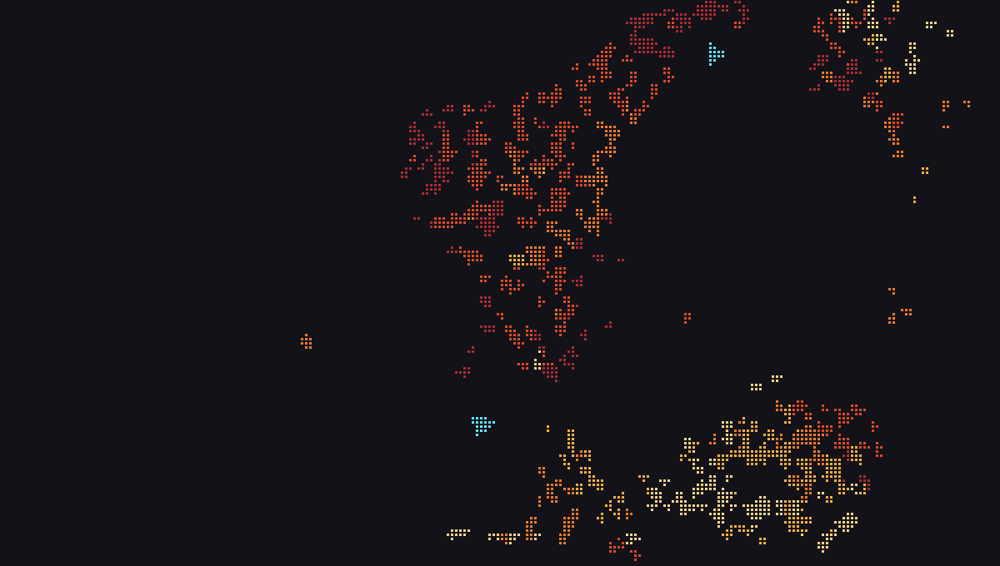
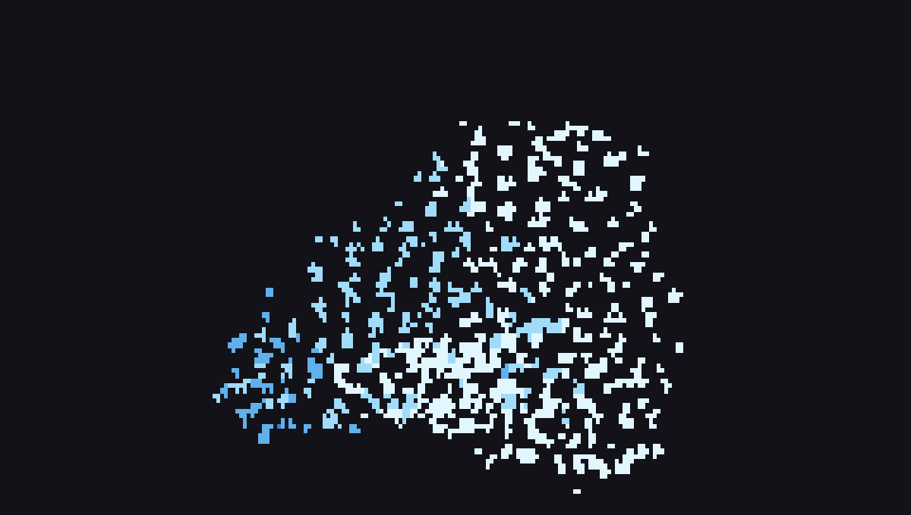
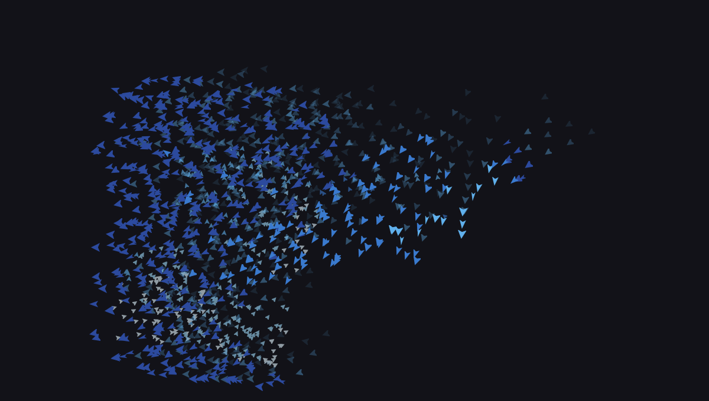
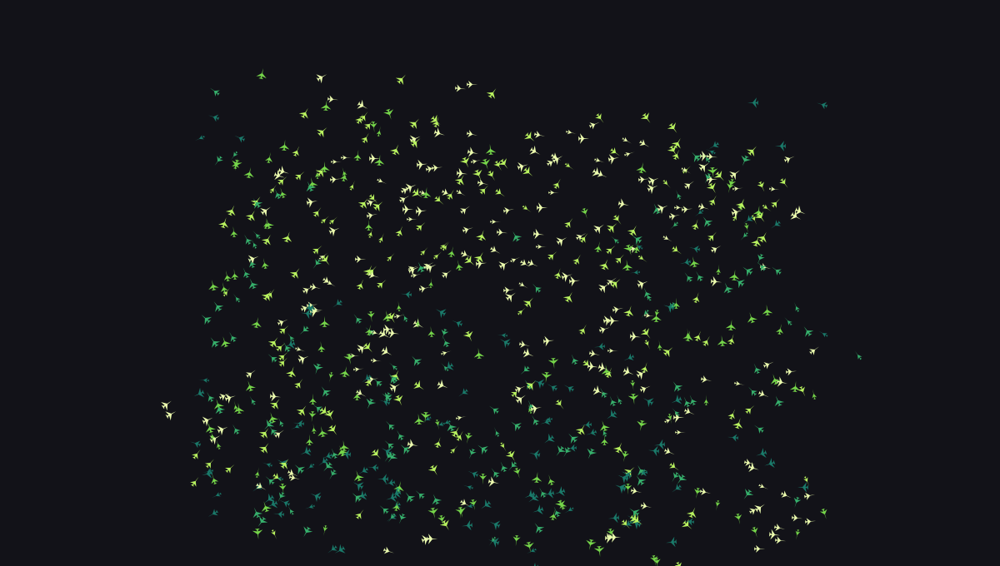
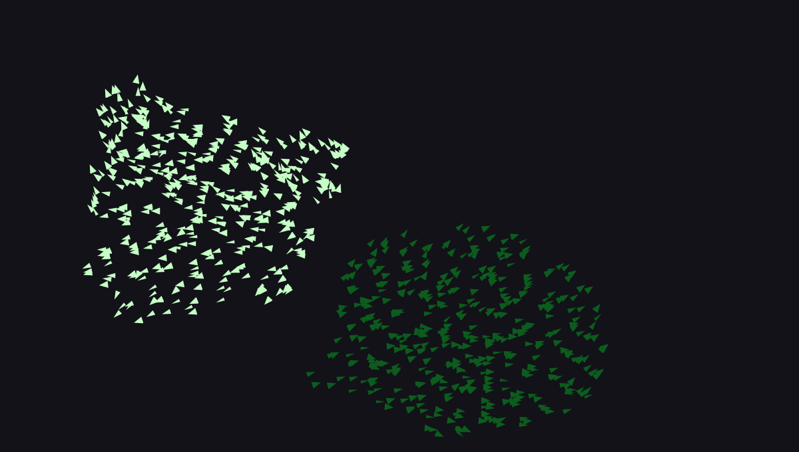

# cbirds

A flock of birds in your terminal.


cbirds is Craig Reynolds' boids, drawn as rotated sprites through the
terminal's graphics protocol, and as braille where there is none. Eight
hundred birds at sixty frames a second cost half a millisecond of CPU a frame.
It is one C99 program that links against libc and libm and nothing else; the
PNG and GIF codecs, the DEFLATE compressor, the sixel encoder and the font are
all in this repository.

Kitty, WezTerm, Ghostty and Konsole show what the GIF above shows. xterm and
foot get sixel, iTerm2 an inline PNG, everything else the same flock in
braille. The GIF was recorded by cbirds itself, with its own encoder, in one
command. So was every image on this page.

## Building

```
git clone https://github.com/clainstone/cbirds
cd cbirds
make
sudo make install        # PREFIX=/usr/local
cbirds
```

Linux, macOS and the BSDs; on Windows, WSL inside Windows Terminal. GCC 7 or
Clang 10 and `make` are enough. `make test` runs the eight suites.

## Terminals

cbirds asks the terminal what it can draw before it takes the screen, and uses
the best of it. Every terminal that can show colour gets a flock; the only
question is how fine.

| terminal | what you see |
|---|---|
| Kitty, WezTerm, Ghostty, recent Konsole | sprites, over the Kitty graphics protocol |
| xterm, foot, mlterm, contour, mintty, Windows Terminal | a picture a frame, in sixel |
| iTerm2 | a picture a frame, as an inline PNG |
| everything else: Alacritty, GNOME Terminal, Terminal.app, tmux | the same flock in braille, eight dots a cell |

`--render kitty|sixel|iterm|braille|sextants|blocks` overrules the choice.
Sextants are two by three solid blocks a cell, bolder than braille and nearly
as fine; they need a font from 2020 or later. Blocks are two half blocks a
cell and work everywhere.

<table>
<tr>
<td width="50%"></td>
<td width="50%"></td>
</tr>
<tr>
<td align="center"><code>--render braille --hawks 2</code></td>
<td align="center"><code>--render sextants --color ice</code></td>
</tr>
</table>

Under braille or sextants only the cells that changed since the last frame are
sent, so a full flock at sixty frames a second costs a text terminal a third
of the bytes it costs Kitty. Nothing paints the background: an empty cell is
the terminal's own, and the flock wears the theme.

## Running

```
cbirds                              a flock, in your terminal's own colours
cbirds --preset murmuration         the starling look
cbirds --hawks 2 --color ember      something to watch
cbirds --flocks 3 --color ice       three flocks that keep to their own
cbirds --depth --trails             a second sky behind the first
cbirds --matrix                     it is raining birds
```

It opens by writing BOIDS across the middle of the screen, lets go, and
flocks; any key ends the writing early. Move the pointer into the flock and it
scatters. Press `q` and it flies off the top.

<table>
<tr>
<td width="50%"></td>
<td width="50%"></td>
</tr>
<tr>
<td align="center"><code>--hawks 2 --color acid</code></td>
<td align="center"><code>--flocks 3 --color ember</code></td>
</tr>
<tr>
<td width="50%"></td>
<td width="50%"></td>
</tr>
<tr>
<td align="center"><code>--depth --trails --color ice</code></td>
<td align="center"><code>--preset murmuration --trails --color ice</code></td>
</tr>
<tr>
<td width="50%"></td>
<td width="50%"></td>
</tr>
<tr>
<td align="center"><code>--preset storm --shape plane --color acid</code></td>
<td align="center"><code>--matrix</code></td>
</tr>
<tr>
<td width="50%"></td>
<td width="50%"></td>
</tr>
<tr>
<td align="center"><code>-n 1100 --color ember</code></td>
<td align="center"><code>--flocks 2 --shape arrow --color matrix</code></td>
</tr>
</table>

The default palette is `theme`: cbirds asks the terminal for its own colours
at startup and builds the ramp from them, so the flock matches whatever you
already look at. `ember`, `ice`, `acid` and `matrix` are the fixed ones.
`--shape` draws an arrow, a plane or a dot from triangles instead of the bird,
and `--sprite FILE` flies any PNG of yours in its own colours.

## The panel

The five parameters worth touching are sliders in the corner, each with its
value and the pair of keys that move it. Lowercase lowers, uppercase raises,
and one keypress is exactly one notch of the bar. `h` hides it.

```
╭────────────────────────────────────╮
│ boundary   ▓▓▓▓░░░░░░░░  0.20  b/B │
│ separation ▓▓▓▓░░░░░░░░ 0.005  s/S │
│ alignment  ▓▓▓▓░░░░░░░░  1.50  a/A │
│ turning    ▓▓▓▓▓▓▓▓░░░░   70°  t/T │
│ perception ▓▓▓▓▓▓░░░░░░  36px  p/P │
│ frame        0.6ms    31KB  60fps  │
│ quit       q                       │
╰────────────────────────────────────╯
```

The flock cannot enter it: the panel's rectangle carries an edge force far
above every other term in the model, and a test places birds against it five
million times to make sure. In a terminal too small to spare the corner it
switches itself off.

| key | | key | |
|---|---|---|---|
| `b`/`B` `s`/`S` `a`/`A` `t`/`T` `p`/`P` | one notch down, one up | `h` | panel |
| `space` | pause | `.` | one frame |
| `0` | back to the defaults | `Tab` | next preset |
| `+` `-` | more birds, fewer | `k` `K` | a hawk more, one fewer |
| `e` | tails | `q` | quit |

Left alone for a minute, it starts moving the sliders itself, one notch every
few seconds. Any key takes them back.

## Options

```
Flock
  -n, --birds COUNT             how many birds (default 800)
  -s, --size PIXELS             sprite size in pixels (default 15)
  -g, --flocks COUNT            flocks that keep to their own kind (default 1)
  -k, --hawks COUNT             predators hunting the flock (default 0)
      --preset NAME             murmuration, swarm, storm
      --seed N                  the same seed gives the same flock

Sliders   0 to 12, as the panel shows them
      --boundary NOTCH          how hard the edges push back (default 4)
      --separation NOTCH        how much a bird keeps its distance (default 4)
      --alignment NOTCH         how much it matches its neighbours (default 4)
      --turning NOTCH           sharpest turn a frame, 12 is instant (default 8)
      --perception PIXELS       how far it sees, 12 to 60 (default 36)

Look
  -c, --color RAMP              theme, ember, ice, acid, matrix
      --shape NAME              bird, arrow, plane, dot
      --sprite FILE             a PNG of your own, kept in its own colours
  -e, --trails                  faint tails behind the flock
      --depth                   a second sky further off: smaller, slower, dimmer birds
  -l, --no-panel                hide the sliders in the corner
      --render HOW              kitty, sixel, iterm, braille, sextants, blocks; auto asks

Oddities
      --matrix                  it is raining birds

Output
      --bench N                 run N frames with no terminal, print the numbers, quit
      --frames N                quit after N frames, for recording
      --snapshot FILE           write the last frame as a PNG
      --record FILE             record a GIF, or a .cast for asciinema, with no terminal, and quit
      --record-fps RATE         frames a second; a GIF can carry up to 50 (default 25)
      --record-seconds SECONDS  how long the GIF runs (default 6)
      --record-size COLSxROWS   the size to record at, in cells (default 96x26)

General
  -h, --help                    the one screen help
      --completion SHELL        completions for bash, zsh or fish
  -V, --version                 show the version and exit
```

That is `cbirds --help`, verbatim. The parser takes what people type:
`-n800`, `--birds=800`, clustered short flags, `--` to end the options, and a
typo is answered with the name you probably meant. `--completion
bash|zsh|fish` prints completions; they come off the same table as the parser
and the help, so none of the three can drift.

## Recording

```
cbirds --record flock.gif --hawks 2 --seed 5
cbirds --record flock.cast --record-fps 30
cbirds --snapshot frame.png --frames 400
```

`--record` needs no terminal. It runs the simulation headless, deterministic
under `--seed`, composites every frame and writes an animated GIF with the
project's own LZW encoder, or, if the name ends in `.cast`, an
[asciinema](https://asciinema.org) recording of what the braille renderer
would have sent: one line of escape text per frame, only the changed cells,
playable in any terminal with `asciinema play`. Eight seconds of seven hundred
birds and two hawks is two megabytes as a cast, and about twice that as a
GIF.

`--snapshot` photographs a live frame, so it wants a terminal: the picture is
whatever that terminal was shown, sprites under Kitty, dots or blocks anywhere
else, at the terminal's size in pixels. The commands that produced every image
on this page are in [docs/README.md](docs/README.md).

## How it works

The bird is one PNG compiled into the binary. At startup it is decoded, scaled
up six times and rotated into sixty headings; each heading is squashed across
the line of flight into three wing positions, tinted into every shade of the
ramp, into the far plane's dimmer shades, into the hawk's colour and into the
three fading steps of a tail. That is twenty-six sets of sixty images, fifteen
hundred in all, built as pixels in about two hundred milliseconds, because each
geometry is rotated once and only tinted per set. Under Kitty they are then
encoded as PNG and uploaded once; a frame afterwards is one placement command
per bird, naming an image by id, inside one synchronized update. The screen is
never cleared after the upload, since clearing would delete the images, and a
test asserts that no frame carries a screen erase.

The other renderers start from the same pixels. Sixel and iTerm2 get the frame
composited onto a canvas and encoded, thirty times a second, which is what a
picture a frame costs a terminal to decode. Braille, sextants and blocks read
the canvas back as cells, a dot lit where a quarter or more of its patch is
bird and the cell coloured by the bird that owns most of it, then send the
cells that differ from the last frame, with one cursor move per run and a
colour only when it changes.

The wings beat at six a second whatever the frame rate, each bird at its own
phase, and now and then one glides. Under `--depth` a third of the birds are
far: smaller, slower, dimmed toward the background, drawn underneath, flocking
only with each other and invisible to the hawk. The hawk is not a boid. It
picks a bird well off, holds that choice long enough to get there, aims where
the bird will be, dives the last ninety pixels, and only a strike on the bird
it chose counts; then it flies straight out the far side and turns back for
another. Every bird within reach flees, partly sideways, which is what makes a
flock stream around a predator and close behind it rather than burst.

The neighbour search is a uniform grid of twelve pixel cells rebuilt every
frame with counting sort, so a bird reads only the cells its perception radius
reaches. A test checks the grid against a brute force scan to 1e-11 at every
radius and every flock count. The compressor in `png.c` is LZ77 with a hash
chain and the fixed Huffman codes of RFC 1951; it is why a 1200 by 680
snapshot is 160 KB where its pixels are 3.3 MB. The GIF writer picks its colour table from the frames and encodes LZW; the
test reads a recording back through a parser written separately from the
writer.

`--bench N` runs N frames with no terminal and prints what they cost, so the
numbers below can be checked rather than believed. A Ryzen laptop, a 1600 by
800 viewport:

| birds | CPU per frame | ceiling | bytes per frame |
|---|---|---|---|
| 400 | 0.23 ms | 4400 fps | 17 KB |
| 800 | 0.53 ms | 1900 fps | 33 KB |
| 2000 | 1.69 ms | 590 fps | 80 KB |
| 4096 | 4.40 ms | 230 fps | 163 KB |

The simulation is not the limit. Terminal bandwidth is: two megabytes a second
at the default, ten at four thousand birds.

## The algorithm

Reynolds' model gives every bird three rules, each computed from the birds
within its perception radius $r$. For bird $i$ at position $p_i$ with heading
$\theta_i$, and neighbours $N_i = \{\, j \ne i : |p_i - p_j| < r \,\}$:

**Separation.** Move away from each neighbour, more from the near ones. cbirds
sums the displacements, which already weights a close bird more than a far one
in the direction that matters:

$$s_i = \sum_{j \in N_i} (p_i - p_j)$$

**Alignment.** Fly the way the neighbours fly: the mean of their heading
vectors.

$$a_i = \frac{1}{|N_i|} \sum_{j \in N_i} (\cos\theta_j,\ \sin\theta_j)$$

**Cohesion.** Move toward the neighbours' centre of mass.

$$c_i = \frac{1}{|N_i|} \sum_{j \in N_i} p_j \;-\; p_i$$

The three are combined with weights into one desired direction, along with a
push $b_i$ from the edges of the screen, and the bird's new heading is the
angle of the sum:

$$d_i = w_s\, s_i + w_a\, a_i + w_c\, c_i + w_b\, b_i, \qquad
\theta_i^{*} = \operatorname{atan2}(d_{i,y},\ d_{i,x})$$

The defaults are $w_s = 0.005$, $w_a = 1.5$, $w_c = 0.01$, $w_b = 0.2$. They
differ by orders of magnitude because the terms do: separation and cohesion are
in pixels, alignment is a unit vector. Three of the four are the panel's
sliders; cohesion is not, because moving it end to end changed nothing anyone
could see.

A bird does not snap to $\theta_i^{*}$. It turns toward it by at most $\tau$
radians in a frame, which is the turning slider, and that limit is what gives a
flock its curved fronts and leading edges rather than a cloud that changes shape
instantly. Then it moves a fixed distance along its heading:

$$\theta_i \leftarrow \theta_i + \operatorname{clamp}(\theta_i^{*} - \theta_i,\ -\tau,\ \tau),
\qquad p_i \leftarrow p_i + v\,(\cos\theta_i,\ \sin\theta_i)$$

Every bird reads the same snapshot of the previous frame and writes into the
next, so the order of updates cannot matter and a seed gives the same run
every time.

The edges are a band a third of the screen wide on the sides and the top, a
sixth at the bottom, in which the push inward grows as $12\,(d/W)^2$ with the
depth $d$ into a band of width $W$, so a bird that brushes the edge is nudged
and a bird that is leaving is turned; past the screen's own edge the push
grows linearly and no longer scales with the slider, so the softest boundary
is still a boundary. Several flocks add two social terms:
separation applies to every bird in reach, but alignment and cohesion only to a
bird's own flock, which is why two flocks can pass through each other and come
out as two; and each flock is leashed to its own centre, the centres shoving
each other apart, which is what keeps three flocks in three parts of the sky.
The hawk and the pointer are two more repulsive terms, weighted above the
flocking so that they win, and tuned so that neither can throw the flock off
the screen.

With $n$ birds the naive neighbour search is $O(n^2)$. The grid makes it
$O(n \cdot k)$ for the $k$ birds in the cells around each one, which is what
lets four thousand birds cost four milliseconds.

## Layout

| | |
|---|---|
| `boids.c` | the simulation, the sprites, the panel, the terminal, the recording |
| `cells.c` | the frame as braille, sextants or blocks, diffed against the last one |
| `sixel.c` | the sixel encoder |
| `kitty_graphics.c` | the buffered Kitty protocol, with flow control |
| `png.c` | PNG decode and encode, DEFLATE both ways, rotate, resize, tint |
| `gif.c` | the animated GIF writer: colour table, LZW, looping |
| `font.c` | the 5 by 7 font the flock writes its name with |
| `spatial_grid.c` | the uniform grid |
| `options.c` | the option table that drives the parser, the help and the completions |
| `tests/` | eight suites, ninety-odd tests, `make test` |
| `docs/` | the images, and the commands that made them |
| `plan.md` | what was built, what was not, and what was taken back out, with the measurements |

## Credits

The model is Craig Reynolds', *Flocks, Herds, and Schools: A Distributed
Behavioral Model*, SIGGRAPH 1987; his page on boids is at
[red3d.com/cwr/boids](https://www.red3d.com/cwr/boids/). The Kitty graphics
protocol is documented at
[sw.kovidgoyal.net/kitty/graphics-protocol](https://sw.kovidgoyal.net/kitty/graphics-protocol/).

If it draws nothing, or the wrong thing, in a terminal that is not in the
table above, open an issue and say which terminal it is and what
`cbirds --render braille` does there. That is the report that helps most.

## License

MIT. See [LICENSE](LICENSE).
