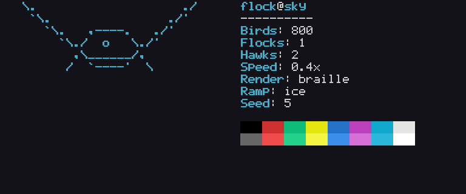
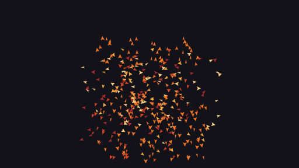
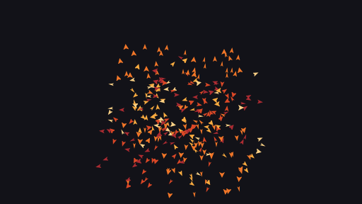

# cbirds

A flock of birds in your terminal.

<p>
<a href="https://github.com/clainstone/cbirds/actions/workflows/tests.yml"></a>
<a href="https://github.com/clainstone/cbirds/tags"></a>
<a href="LICENSE"></a>


<a href="#terminals"></a>
<a href="https://github.com/agarrharr/awesome-cli-apps#screensavers"></a>
<a href="https://github.com/rothgar/awesome-tuis#screensavers"></a>
<a href="https://github.com/fosslife/awesome-ricing#show-off-scripts"></a>
</p>

<p align="center"></p>

<p align="center"><code>cbirds --render kitty --hawks 2 --color ice --speed 0</code></p>

Craig Reynolds' boids, drawn in braille in any terminal, and as sprites over
the Kitty graphics protocol in Kitty and Ghostty. One C99 program, no
dependencies. Every clip on this page was recorded by cbirds itself.

<table>
<tr>
<td width="50%"></td>
<td width="50%"></td>
</tr>
<tr>
<td align="center"><code>cbirds --render kitty --hawks 2 --color ice --speed 0</code></td>
<td align="center"><code>cbirds --render kitty --flocks 3 --color ember</code></td>
</tr>
<tr>
<td width="50%"></td>
<td width="50%"></td>
</tr>
<tr>
<td align="center"><code>cbirds --render kitty --matrix --speed 0</code></td>
<td align="center"><code>cbirds --render kitty --depth --trails --color ice</code></td>
</tr>
<tr>
<td width="50%"></td>
<td width="50%"></td>
</tr>
<tr>
<td align="center"><code>cbirds --render braille --hawks 2 --color ice</code></td>
<td align="center"><code>cbirds --render sextants --color acid --speed 2</code></td>
</tr>
</table>

## Install

### Homebrew

macOS and Linux. Completions for bash, zsh and fish come with it, and
`brew upgrade` keeps it up to date.

<!-- test: brew-install -->
```
brew install clainstone/tap/cbirds
```

### apt

Debian 12, Ubuntu 22.04 and later, and their derivatives, on amd64 or arm64,
from its [apt repository](https://clainstone.com/apt). Completions come with
it, and `sudo apt upgrade` keeps it up to date.

<!-- test: apt-install -->
```
sudo apt install curl
curl -fsSL https://clainstone.com/apt/cbirds.gpg | sudo tee /etc/apt/keyrings/cbirds.gpg >/dev/null
echo "deb [signed-by=/etc/apt/keyrings/cbirds.gpg] https://clainstone.com/apt stable main" | sudo tee /etc/apt/sources.list.d/cbirds.list
sudo apt update
sudo apt install cbirds
```

Or just the package, without the repository and so without updates: the
`.deb` files are on the [release page](https://github.com/clainstone/cbirds/releases/latest),
for `sudo apt install ./cbirds_*.deb`.

### From source

```
git clone https://github.com/clainstone/cbirds
cd cbirds
make
sudo make install
cbirds
```

That puts one file, `/usr/local/bin/cbirds`. Without sudo, in your home
instead (`~/.local/bin` has to be on your `PATH`):

```
make install PREFIX="$HOME/.local"
```

Linux and macOS. You need a C compiler and `make`, nothing else.
`make test` runs the tests. The build uses the system's `cc` and honours `CC`,
`CFLAGS`, `LDFLAGS`, `PREFIX` and `DESTDIR`, so `make CC=clang` and packaging
work as usual.

## Uninstall

### Homebrew

The second line removes the tap as well; leave it out to keep it.

<!-- test: brew-uninstall -->
```
brew uninstall cbirds
brew untap clainstone/tap
```

### apt

The last two lines remove the repository as well; leave them out to keep it.

<!-- test: apt-uninstall -->
```
sudo apt remove cbirds
sudo rm /etc/apt/sources.list.d/cbirds.list /etc/apt/keyrings/cbirds.gpg
sudo apt update
```

A `.deb` installed on its own goes with the first line alone.

### From source

In the same directory, and with the same `PREFIX` it was installed with:

```
sudo make uninstall                     # installed with sudo make install
make uninstall PREFIX="$HOME/.local"    # installed in your home
```

Without the clone it is the one file: `sudo rm /usr/local/bin/cbirds`, or
`rm ~/.local/bin/cbirds`.

## Use

```
cbirds                              a flock in braille, in your terminal's own colours
cbirds --render kitty               sprites, in Kitty or Ghostty
cbirds --preset murmuration         the starling look
cbirds --hawks 2 --color ice        something to watch
cbirds --flocks 3 --color ember     three flocks that keep to their own
cbirds --color prism                a turn runs a rainbow through the flock
cbirds --depth --trails             a second sky behind the first
cbirds --link                       one sky across several terminals
cbirds --matrix                     it is raining birds
cbirds --say "back in five"         the flock writes it, and holds it as a sign
cbirds --clock                      the flock tells the time
cbirds --clock --seconds            and the seconds, HH:MM:SS
cbirds --say "ciao" --font-size 8   letters eight rows tall, from 4 to 10
cbirds --picture logo.png           the flock draws a PNG; --shape dot and -n 2000 suit it
cbirds --screensaver --clock        a lock screen that tells the time; any key quits
fastfetch | cbirds                  the letters of anything take flight
```

It opens by writing BOIDS, lets go, and flocks. Move the pointer into the
flock and it scatters. Press `q` and it flies off the top. Left alone for a
minute, it starts moving the sliders itself; any key takes them back.

`h` opens a panel of sliders in the corner, and `--panel` opens it from the
start. Lowercase lowers, uppercase raises, one press is one notch. `speed`
flies the same flock slower or faster, from a fifth of its pace to thirteen
fifths. With two flocks or more the panel grows one more row, `avoidance` on
`g`/`G`: at the bottom the flocks mix into one flock of two or three colours,
in the middle, where it starts, each keeps to its own kind and flies where it
likes, and at the top they keep well apart.

`--unlock-fps` removes the frame delay and renders as fast as the terminal accepts
frames. The simulation still advances in real time, so unlocking it does not make
the birds fly faster. It is useful for profiling; normal runs are capped at 60
fps.

```
╭────────────────────────────────────╮
│ boundary   ▓▓▓▓░░░░░░░░  0.20  b/B │
│ separation ▓▓▓▓░░░░░░░░ 0.005  s/S │
│ alignment  ▓▓▓▓░░░░░░░░  1.50  a/A │
│ turning    ▓▓▓▓▓▓▓▓░░░░   70°  t/T │
│ perception ▓▓▓▓▓▓░░░░░░  36px  p/P │
│ speed      ▓░░░░░░░░░░░  0.4×  v/V │
│ frame        0.6ms    31KB  60fps  │
│ quit       q                       │
╰────────────────────────────────────╯
```

| key | | key | |
|---|---|---|---|
| `b`/`B` `s`/`S` `a`/`A` `t`/`T` `p`/`P` `v`/`V` `g`/`G` | one notch down, one up | `h` | panel |
| `Space` | pause | `.` | one frame |
| `0` | back to the defaults | `Tab` | next preset |
| `+` `-` | more birds, fewer | `k` `K` | a hawk more, one fewer |
| `e` | tails | `q` | quit |
| `Enter` | letters off, or home | | |

## Anything can fly

Pipe text into cbirds and the text is the flock.

```
fastfetch | cbirds
figlet -f big hello | cbirds
ls --color=always -la | cbirds
git log --oneline --graph --color=always | cbirds
cbirds --text poem.txt
```

<p align="center"></p>

<p align="center"><code>cat docs/neofetch.txt | cbirds</code></p>

It opens with the text exactly as the command printed it, in its own colours,
laid out as a terminal would have laid it out: cbirds reads the escape
sequences, so a logo with its information beside it comes out as a logo with its
information beside it. A few seconds later one letter leaves and the ones near
it follow, a wave that crosses the screen in about a second, and the letters
fly as a flock. After twenty seconds or so they are called home, and every
letter lands on its own cell: the screen is what the command printed again, to
the cell. After a pause it happens again.

`Enter` sends the letters off, or calls them home at once. Move the pointer
through the text at rest and the letters it touches fly up, and they come back
when it has gone. `q` sends them off the top, as it does the birds.

A letter is drawn as itself, in its own colours, with its bold and underline,
wherever it is; one with no colour of its own takes the flock's while it flies.
A background colour stays where it was printed. Wide characters take two cells.
Hawks work, and are arrows over text. `--birds`, `--flocks`, `--depth`,
`--matrix`, `--shape`, `--sprite`, `--size` and tails do not apply: the text
decides how many letters there are, and a letter has no sprite. `--render
kitty` draws text too. The panel is laid over the text, and the letters under it
still land there.

When standard input is not a terminal, the keys are read from the terminal
itself, its controlling one, `/dev/tty`, on Linux and on macOS alike; with no
terminal at all, as from a service or an editor's run button, cbirds says that it
needs one and stops. A pipe is read to its end, or until it has been quiet for a second and a
half, or has gone on for eight seconds, or has sent a megabyte, and what is kept
is the last screenful, as a terminal would keep it; `tail -f log | cbirds` shows
what the log had when it went quiet. A pipe that sends nothing for three seconds,
and text with nothing to see in it, give the ordinary flock. If the window
changes size, the text is laid out again on the new one. A sign is what the flock
writes, and text is the flock, so `--say`, `--clock`, `--seconds` and `--picture`
stop with a usage error beside `--text` or beside text on a pipe.

Recordings take text too, and then run a whole cycle, 34 seconds, unless
`--record-seconds` says otherwise. A recording never starts a wave it has no time
to finish, so a whole cycle ends on the text as it was printed, and a GIF of it
loops without a jump:

```
fastfetch | cbirds --record fetch.cast
cbirds --text poem.txt --record poem.gif --record-fps 20
```

A GIF of text is drawn with a 5 by 7 font in cells of 12 by 20 pixels, so it
shows the letters rather than dots. `--snapshot` takes text, and `--bench` takes
`--text` and never a pipe it happens to be in.

## Signs

`--say TEXT` has the flock write TEXT where it would write BOIDS, and keep it
up. A sign is for reading, so it is held for thirty to forty-five seconds, and
then the flock lets go for eight to twelve, flies as a murmuration, and writes
it again. The birds that write do not stand still: each hovers round its place
in a small loop of its own, so the strokes shimmer and stay sharp. The colour
runs along the text, from one end of the ramp to the other.

<p align="center"></p>

<p align="center"><code>cbirds --say "back in five"</code></p>

The rest of the flock wheels round the sign, not through it: all of it the same
way, on an ellipse round the text, as one river that bunches and thins, and the
other way round the next time the sign is written. Each bird of it wears the
colour of its heading, so the sky round the text turns like a wheel.

The letters are a seventh of the window's rows tall: four rows at 80 by 24,
five at 120 by 34, seven at 200 by 50. `--font-size ROWS` sets them from 4 to
10 rows, on any window. Under four the text is lost in the river, and over ten
the birds, which are as wide as the cells of the letters, are as heavy as a
flock with nothing to write and the river is two bands above and below the
text. A sign never takes more than half the width of the screen and not quite
half its height, or half and half on a small terminal, so that the river has
room; a size that does not fit there is made as large as fits, on up to three
lines, and a long text that would be too small to read takes up to two thirds
by three fifths. On a small terminal more of the flock writes, so that the
birds that are left have sky to fly in.

Lower case is written in capitals, and an accented letter as its plain one, so
that città is CITTA and Straße is STRASSE; a symbol, or a letter of another
alphabet, has no plain letter and is left out. A text the flock has too few
birds to write is said so on stderr and left unwritten, and one that turns out
too big for the screen once the run has started is said so there when the run
ends, after the terminal is given back. A key does not end a sign. Move the
pointer through it and the birds it reaches scatter, and come back when it has
gone. A hawk does the same to the places it flies over, for less time: a fifth
of a second to two fifths, and only the places within a hawk's own width of its
path. A hawk is turned from the text as the flock is, if less firmly than it is
drawn to its prey, so it hunts round the sign with the river and crosses it when
a chase takes it there. With one hawk up, 800 birds and a screen of 96 by 26
cells, about 3% of the writers are scattered at any moment, and about 7% with
two; a clock stays readable.

`--clock` writes the time, HH:MM, in local time, and follows the locale for the
hour: twelve hours, with no AM or PM, if `LC_TIME` has a time format that shows
the hour on a twelve hour clock, and twenty four otherwise. The colon rises and
settles once a second. At each new minute the digits that change let go and
other birds write the new ones, while the rest of the time stays where it is,
so the clock can be read at any moment. On the hour the whole of it lets go for
a few seconds, and the flock writes the next time.

<p align="center"></p>

<p align="center"><code>cbirds --clock-at 10:09:52</code></p>

`--seconds` shows the seconds too, HH:MM:SS, and is a clock on its own, as
`--clock-at` is. A digit of the seconds is not let go: its own birds hop over to
the next one, which takes them a fraction of a second, so the seconds can be
read as they tick. The minutes and the hour change as they do without it.

`--picture FILE` has the flock draw a PNG instead. Every bird takes a place in
the opaque part of the picture, where a pixel with an alpha above half is ink,
the places spread evenly over it, and wears the picture's colour there. The
picture is cut down to at most eight colours, which are the palette of the
run; with `--color` given they are not, and the light and dark of the picture
pick shades of that ramp. A bird keeps its colour while it flies, and the
picture is held, let go of and drawn again as a sign is. `--shape dot` and more
birds, `-n 2000`, draw it best. The file is read as `--sprite` reads one: a PNG
of up to 4 MB, in any of the colour types PNG has.

A sign picks a bird as wide as the distance between the cells of its letters
unless you give `--size`, so larger letters are written by larger birds, up to
the usual thirty pixels, and the whole flock flies at that size. `--shape dot`
is the crispest, and more birds make thicker strokes.

A recording runs on its own clock, not the wall's, so the time a recorded
`--clock` tells is the local time at which the recording started, moved on by
its frames. `--clock-at 10:09:50` starts it from a time you choose instead,
which is how to record a change of minute. On its own it starts a clock.

## Screensaver

`--screensaver` quits at once on any key, mouse click or pointer movement, with
no flight out. Input in the first half second is ignored, because it is
whatever started the lock. It goes with everything else, so
`cbirds --screensaver --clock` is a lock screen that tells the time. For tmux,
which locks a client after `lock-after-time` idle seconds and runs `lock-command`
on it:

```
set -g lock-after-time 300
set -g lock-command "cbirds --screensaver --clock"
```

And in zsh, which sends itself an alarm after `TMOUT` idle seconds at the
prompt and runs `TRAPALRM`:

```
TMOUT=300
TRAPALRM() { cbirds --screensaver --clock }
```

## Terminals

cbirds draws in braille by default, in every terminal: no terminal is guessed
at. `--render sextants` and `--render blocks` are bolder text versions;
sextants need a font from 2020 or later, blocks work everywhere. In text mode
only the cells that changed are sent, and the background is never painted, so
the flock wears your theme.

`--render kitty` draws real sprites over the Kitty graphics protocol, and is
yours to ask for: it is made for **Kitty** and **Ghostty**. In any other
terminal what it does is undefined. WezTerm, Konsole, iTerm2, Warp and Rio
answer for the protocol and then draw too few birds, the wrong ones or none,
and inside tmux the sprites never reach the terminal.

If braille does not look right in your terminal, open an issue and say which
terminal it is. That is the report that helps most.

## One sky, several terminals

```
cbirds --link        # in one terminal
cbirds --link        # in another
```

Birds that fly out of the edge of one window fly in through the edge of the
next, at the same height and in the same direction. Two terminals side by side,
or two panes of a split, become one sky with a flock flowing across the gap.
Hawks cross as well.

The windows lie in a row in the order they were started, so start them from
left to right: the second joins on the right of the first, the third on the
right of the second. Only an edge that has a window behind it is open. At the
ends of the row the outer edge is a wall, as it is alone. A window that closes
leaves the row, and the two beside it become neighbours.

Each window keeps its own settings, its own `--birds` among them, and its birds
come and go: a window can empty and fill again. A window that holds 4080 birds
says so, and its neighbours treat that edge as a wall until it has room; the
few already on their way when it said so wait at its door and come in as places
free, so no bird is lost between two windows. A bird sees only the birds of its
own window, so a flock does not look across the gap; it follows its leaders
across. While a window is writing BOIDS, or is paused, it has no room and takes
nobody in, and nobody leaves it.

A sign goes with it, `--say`, `--clock` or `--picture`. The birds that write
hold their places and never cross, and the rest of the flock crosses as it does
without one, but a window with a sign keeps the birds it takes to write it.
`--screensaver` goes with it too: any key quits that window, and it leaves the
sky.

The windows talk through Unix sockets in a directory that is yours alone:
`$XDG_RUNTIME_DIR/cbirds`, or `$TMPDIR/cbirds-UID`, or `/tmp/cbirds-UID`.
cbirds refuses to use one that belongs to somebody else or that others can write
in, and says which, and it looks again every second: a directory that has been
removed is made again and the windows find each other in it, and one that has
been made into anything else leaves each window alone. The sockets are removed
when a window quits or is interrupted, and the one a killed window leaves behind
is swept away by the others.

A letter has its home in its own window, so `--link` with `--text` or with text
piped in is refused, and so is `--link` with `--record` or `--bench`: it joins
the windows that are open now, so it needs a live terminal. No clip of it is on
this page for the same reason: a recording has one window.

## Options

```
Flock
  -n, --birds COUNT             how many birds (default 800)
  -s, --size PIXELS             sprite size in pixels (default 30)
  -g, --flocks COUNT            flocks that keep to their own kind (default 1)
  -k, --hawks COUNT             predators hunting the flock (default 0)
      --preset NAME             murmuration, swarm, storm
      --seed N                  the same seed gives the same flock

Sliders   0 to 12, as the panel shows them
      --boundary NOTCH          how hard the edges push back (default 4)
      --separation NOTCH        how much a bird keeps its distance (default 4)
      --alignment NOTCH         how much a bird matches its neighbours (default 4)
      --turning NOTCH           sharpest turn a frame, 12 is instant (default 8)
      --perception PIXELS       how far a bird sees, 12 to 60 (default 36)
      --speed NOTCH             how fast the flock flies, 0.2x to 2.6x (default 1, 0.4x)
      --avoidance NOTCH         how much flocks keep out of each other's way (default 4)

Look
  -c, --color RAMP              theme, ember, ice, acid, matrix, aurora, prism, potion, dusk, ash
      --shape NAME              bird, arrow, plane, dot
      --sprite FILE             a PNG you supply, kept in its own colours
  -e, --trails                  faint tails behind the flock
      --depth                   a second sky further off: smaller, slower, dimmer birds
  -l, --panel                   the sliders in the corner from the start; h toggles them
      --render HOW              braille by default; sextants, blocks, or kitty in Kitty and Ghostty

Sign
      --say TEXT                the flock writes TEXT and holds it as a sign
      --clock                   the flock tells the time, HH:MM, in local time
      --clock-at TIME           start the clock at HH:MM or HH:MM:SS, not now
      --seconds                 the clock shows the seconds too, HH:MM:SS
      --font-size ROWS          how many rows tall a sign's letters are, 4 to 10
      --picture FILE            the flock draws a PNG, in its colours unless --color is given

Oddities
      --matrix                  it is raining birds
      --text FILE               a file whose letters take flight; text piped in does the same

Output
      --bench N                 run N frames with no terminal, print the numbers, quit
      --frames N                quit after N frames, for recording
      --snapshot FILE           write the last frame as a PNG
      --record FILE             record a GIF, or a .cast for asciinema, with no terminal, and quit
      --record-fps RATE         frames a second; a GIF can carry up to 50 (default 25)
      --record-seconds SECONDS  how long the recording runs (default 6, 34 for text)
      --record-size COLSxROWS   the size to record at, in cells (default 96x26)

General
      --unlock-fps              render as fast as the terminal allows
      --screensaver             quit at once on any key, click or movement, for tmux's lock-command
      --link                    share one sky with other cbirds --link windows
  -h, --help                    the one-screen help
      --completion SHELL        completions for bash, zsh or fish
  -V, --version                 print the version and quit
```

That is the options part of `cbirds --help`, as it prints it; the full help
adds usage, examples and the keys.

`--sprite` takes any PNG up to 4 MB: palette, grayscale, RGB or RGBA, at any bit
depth, interlaced or not. `--seed` is the same flock on every system: the random
numbers are cbirds' own, not the C library's.

## Recording

```
cbirds --record flock.gif --hawks 2 --seed 5
cbirds --record flock.cast --record-fps 30
cbirds --snapshot frame.png --frames 400
```

`--record` needs no terminal: it runs the flock headless and writes the GIF
with its own encoder. If the file name ends in `.cast` you get an
[asciinema](https://asciinema.org) recording instead, which plays in any
terminal and is about half the size. A GIF is drawn with sprites unless
`--render braille` or `--render sextants` asks for the cells, as a text
terminal would show them. `--snapshot` saves a live frame as a PNG, so it wants a
terminal. The commands behind every clip here are in
[docs/README.md](docs/README.md).

## How it works

The bird is one PNG compiled into the binary. At startup it is rotated into
sixty headings, squashed into three wing positions, and tinted into every
shade on the ramp: about fifteen hundred small images, built in a fifth of a
second. They are sampled down into braille, sextants or blocks, or, with
`--render kitty`, uploaded once, and a frame is then one short command per
bird. The wings beat six times a second, and now and then
a bird glides.

Neighbours are found with a grid, so eight hundred birds cost about half a
millisecond of CPU a frame, and four thousand birds about four milliseconds.
The PNG, GIF and DEFLATE code is all in the repository; there is no
zlib, no libpng, no ncurses. `cbirds --bench 300` prints the numbers on your
machine.

## The algorithm

Each bird sees only its neighbours and follows three rules: keep your
distance, fly the way they fly, drift towards their middle. Add a nudge away
from the edges of the screen, sum the four pulls, and turn towards the result,
but only so far in one frame. That limit is what gives the flock curved fronts
instead of a cloud snapping into shape. Repeat sixty times a second and a
murmuration falls out of it; nothing in the code knows what a flock looks
like. Reynolds' paper, below, has the rest.

## Credits

The model is from Craig Reynolds' *Flocks, Herds, and Schools: A Distributed
Behavioral Model*, SIGGRAPH 1987; his page on boids is at
[red3d.com/cwr/boids](https://www.red3d.com/cwr/boids/). The Kitty graphics
protocol is documented at
[sw.kovidgoyal.net/kitty/graphics-protocol](https://sw.kovidgoyal.net/kitty/graphics-protocol/).

## License

MIT. See [LICENSE](LICENSE).
