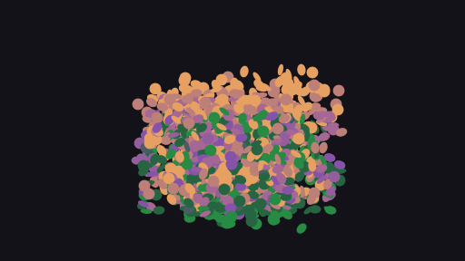
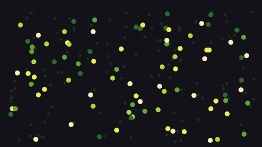
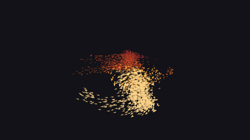

# cbirds

A flock of birds in your terminal.

<p>
<a href="https://github.com/clainstone/cbirds/actions/workflows/tests.yml"></a>
<a href="https://github.com/clainstone/cbirds/tags"></a>
<a href="LICENSE"></a>


<a href="#terminals"></a>
<a href="https://github.com/agarrharr/awesome-cli-apps#screensavers"></a>
<a href="https://github.com/rothgar/awesome-tuis#screensavers"></a>
<a href="https://github.com/fosslife/awesome-ricing#show-off-scripts"></a>
</p>

<p align="center"></p>

<p align="center"><code>cbirds --render kitty --hawks 2 --color ice --speed 0</code></p>

Craig Reynolds' boids, drawn in braille in any terminal, and as sprites over
the Kitty graphics protocol in Kitty and Ghostty. One C99 program, no
dependencies. Besides the flock it flies the text you pipe into it, writes a
sign or the time, draws a PNG, flies in three dimensions, flashes as fireflies
and shares one sky between terminals. Every clip on this page was recorded by
cbirds itself, and [docs/README.md](docs/README.md) has the command behind each.

<table>
<tr>
<td width="50%"></td>
<td width="50%"></td>
</tr>
<tr>
<td align="center"><code>cbirds --render kitty --hawks 2 --color ice --speed 0</code></td>
<td align="center"><code>cbirds --render kitty --flocks 3 --color ember</code></td>
</tr>
<tr>
<td width="50%"></td>
<td width="50%"></td>
</tr>
<tr>
<td align="center"><code>cbirds --render kitty --matrix --speed 0</code></td>
<td align="center"><code>cbirds --render kitty --depth --trails --color ice</code></td>
</tr>
<tr>
<td width="50%"></td>
<td width="50%"></td>
</tr>
<tr>
<td align="center"><code>cbirds --render braille --hawks 2 --color ice</code></td>
<td align="center"><code>cbirds --render sextants --color acid --speed 2</code></td>
</tr>
</table>

## Install

### Homebrew

macOS and Linux. Completions for bash, zsh and fish come with it, and
`brew upgrade` keeps it up to date.

<!-- test: brew-install -->
```
brew install clainstone/tap/cbirds
```

### apt

Debian 12, Ubuntu 22.04 and later, and their derivatives, on amd64 or arm64,
from its [apt repository](https://clainstone.com/apt). Completions come with
it, and `sudo apt upgrade` keeps it up to date.

<!-- test: apt-install -->
```
sudo apt install curl
curl -fsSL https://clainstone.com/apt/cbirds.gpg | sudo tee /etc/apt/keyrings/cbirds.gpg >/dev/null
echo "deb [signed-by=/etc/apt/keyrings/cbirds.gpg] https://clainstone.com/apt stable main" | sudo tee /etc/apt/sources.list.d/cbirds.list
sudo apt update
sudo apt install cbirds
```

Or just the package, without the repository and so without updates: the
`.deb` files are on the [release page](https://github.com/clainstone/cbirds/releases/latest),
for `sudo apt install ./cbirds_*.deb`.

### From source

```
git clone https://github.com/clainstone/cbirds
cd cbirds
make
sudo make install
cbirds
```

That puts one file, `/usr/local/bin/cbirds`. Without sudo, in your home
instead (`~/.local/bin` has to be on your `PATH`):

```
make install PREFIX="$HOME/.local"
```

Linux and macOS. You need a C compiler and `make`, nothing else.
`make test` runs the tests. The build uses the system's `cc` and honours `CC`,
`CFLAGS`, `LDFLAGS`, `PREFIX` and `DESTDIR`, so `make CC=clang` and packaging
work as usual.

## Uninstall

### Homebrew

The second line removes the tap as well; leave it out to keep it.

<!-- test: brew-uninstall -->
```
brew uninstall cbirds
brew untap clainstone/tap
```

### apt

The last two lines remove the repository as well; leave them out to keep it.

<!-- test: apt-uninstall -->
```
sudo apt remove cbirds
sudo rm /etc/apt/sources.list.d/cbirds.list /etc/apt/keyrings/cbirds.gpg
sudo apt update
```

A `.deb` installed on its own goes with the first line alone.

### From source

In the same directory, and with the same `PREFIX` it was installed with:

```
sudo make uninstall                     # installed with sudo make install
make uninstall PREFIX="$HOME/.local"    # installed in your home
```

Without the clone it is the one file: `sudo rm /usr/local/bin/cbirds`, or
`rm ~/.local/bin/cbirds`.

## Use

```
cbirds                              a flock in braille, in your terminal's own colours
cbirds --render kitty               sprites, in Kitty or Ghostty
cbirds --preset murmuration         the starling look
cbirds --hawks 2 --color ice        something to watch
cbirds --3d                         a murmuration in three dimensions
cbirds --fireflies                  a summer night, and they fall into step
fastfetch | cbirds                  the letters of anything take flight
cbirds --say "back in five"         the flock writes it, and holds it as a sign
cbirds --clock                      the flock tells the time
cbirds --picture logo.png           the flock draws a PNG
cbirds --link                       one sky across several terminals
cbirds --screensaver --clock        a lock screen that tells the time; any key quits
```

The rest of the looks are in Options. `--flocks 3 --color ember` makes three
flocks that keep to their own kind, `--color prism` lets a turn run a rainbow
through the flock, `--depth --trails` draws a second sky behind the first, and
`--matrix` rains birds.

Run plainly, it opens by writing BOIDS, lets go, and flocks. Move the pointer
into the flock and it scatters. Whip the pointer through it and a wave of light
runs across the flock, as it does when a hawk dives. Press `q` and the flock
flies off the top. Left alone for a minute, it moves one slider a notch every
four seconds, and any key ends that. A sign (`--say`, `--clock`, `--picture`), a
text, a night (`--fireflies`), a space (`--3d`) and a shared sky (`--link`)
begin in their own ways and treat the pointer in theirs, and their sections
below say how.

`h` opens a panel of sliders in the corner, and `--panel` opens it from the
start. Lowercase lowers, uppercase raises, one press is one notch. `speed`
flies the same flock slower or faster, from a fifth of its pace to thirteen
fifths. With two flocks or more the panel grows one more row, `avoidance` on
`g`/`G`: at the bottom the flocks mix into one flock of two or three colours,
in the middle, where it starts, each keeps to its own kind and flies where it
likes, and at the top they keep well apart.

```
╭────────────────────────────────────╮
│ boundary   ▓▓▓▓░░░░░░░░  0.20  b/B │
│ separation ▓▓▓▓░░░░░░░░ 0.005  s/S │
│ alignment  ▓▓▓▓░░░░░░░░  1.50  a/A │
│ turning    ▓▓▓▓▓▓▓▓░░░░   70°  t/T │
│ perception ▓▓▓▓▓▓░░░░░░  36px  p/P │
│ speed      ▓░░░░░░░░░░░  0.4×  v/V │
│ frame        0.6ms    31KB  60fps  │
│ quit       q                       │
╰────────────────────────────────────╯
```

| key | | key | |
|---|---|---|---|
| `b`/`B` `s`/`S` `a`/`A` `t`/`T` `p`/`P` `v`/`V` `g`/`G` | one notch down, one up | `h` | panel |
| `Space` | pause | `.` | one frame |
| `0` | back to the defaults | `Tab` | next preset |
| `+` `-` | more birds, fewer | `k` `K` | a hawk more, one fewer |
| `e` | tails | `q` | quit |
| `Enter` | letters off, or home | | |

`cbirds -h` prints the options a newcomer needs on one screen, and `--help`
prints all of them, with examples and these keys. `--unlock-fps` removes the
frame delay and renders as fast as the terminal accepts frames. The simulation
still advances in real time, so unlocking it does not make the birds fly faster.
It is for profiling; normal runs are capped at 60 fps.

## Anything can fly

Pipe text into cbirds and the text is the flock.

```
fastfetch | cbirds
figlet -f big hello | cbirds
ls --color=always -la | cbirds
git log --oneline --graph --color=always | cbirds
cbirds --text poem.txt
```

<p align="center"></p>

<p align="center"><code>cat docs/neofetch.txt | cbirds</code></p>

It opens with the text exactly as the command printed it, in its own colours,
laid out as a terminal would have laid it out: cbirds reads the escape
sequences, so a logo with its information beside it comes out as a logo with its
information beside it. A few seconds later one letter leaves and the ones near
it follow, a wave that crosses the screen in about a second, and the letters
fly as a flock. After twenty seconds or so they are called home, and every
letter lands on its own cell: the screen is what the command printed again, to
the cell. After a pause it happens again.

`Enter` sends the letters off, or calls them home at once. Move the pointer
through the text at rest and the letters it touches fly up, and they come back
when it has gone. `q` sends them off the top, as it does the birds.

A letter is drawn as itself, in its own colours, with its bold and underline,
wherever it is; one with no colour of its own takes the flock's while it flies.
A background colour stays where it was printed. Wide characters take two cells.
Hawks work, and are arrows over text: they scatter the letters they come near.
No wave of light runs through a text, whether a hawk dives or the pointer is
whipped; the letters have the wave that sends them up. `--birds`, `--flocks`,
`--depth`, `--matrix`, `--shape`, `--sprite`, `--size` and tails do not apply:
the text decides how many letters there are, and a letter has no sprite.
`--render kitty` draws text too. The panel is laid over the text, and the
letters under it still land there. `--screensaver` goes with text and quits on a
key typed at the terminal. The modes that make their own flock, `--fireflies`,
`--3d`, `--say`, `--clock` and `--picture`, are refused beside it, as is
`--link`; [Options that do not go together](#options-that-do-not-go-together)
lists them all.

When standard input is not a terminal, the keys are read from the terminal
itself. A pipe is read to its end, or until it has been quiet for a second and a
half, or has gone on for eight seconds, or has sent a megabyte, and what is kept
is the last screenful, as a terminal would keep it; `tail -f log | cbirds` shows
what the log had when it went quiet. A pipe that sends nothing for three
seconds, and text with nothing to see in it, give the ordinary flock. If the
window changes size, the text is laid out again on the new one.

Recordings take text too, and then run a whole cycle, 34 seconds, unless
`--record-seconds` says otherwise:

```
fastfetch | cbirds --record fetch.cast
cbirds --text poem.txt --record poem.gif --record-fps 20
```

A GIF of text is drawn with a 5 by 7 font in cells of 12 by 20 pixels, so it
shows the letters rather than dots. `--snapshot` takes text, and `--bench` takes
`--text` and never a pipe it happens to be in.

## Signs and the clock

`--say TEXT` has the flock write TEXT where it would write BOIDS, and keep it
up. A sign is for reading, so it is held for thirty to forty-five seconds, and
then the flock lets go for eight to twelve, flies as a murmuration, and writes
it again.

<p align="center"></p>

<p align="center"><code>cbirds --say "back in five"</code></p>

The birds that write do not stand still: each hovers round its place in a small
loop of its own, so the strokes shimmer and stay sharp. The colour runs along
the text, from one end of the ramp to the other. The rest of the flock flies
round the sign, not through it. On a small terminal the sign takes less of it,
down to half the width and half the height at 96 by 26 cells, and more of the
flock writes, so that the birds that are left have sky to fly in. A sign picks a
bird as wide as the distance between the cells of its letters unless you give
`--size`, so a short text is written with the usual bird and a long one on a
small terminal with a smaller one. `--shape dot` gives sharp strokes, and more
birds make thicker ones.

Lower case is written in capitals, and an accented letter as its plain one, so
that città is CITTA and Straße is STRASSE; a symbol, or a letter of another
alphabet, has no plain letter and is left out. Text too long for one line wraps
at its spaces onto two or three, as large as fits. A text the flock has too few
birds to write is said so on stderr and left unwritten, and one that turns out
too big for the screen once the run has started is said so there when the run
ends, after the terminal is given back. A key does not end a sign.

`--clock` writes the time, HH:MM, in local time, and follows the locale for the
hour: twelve hours, with no AM or PM, if `LC_TIME` has a time format that shows
the hour on a twelve hour clock, and twenty four otherwise. The colon rises and
settles once a second. At each new minute the digits that change let go and
other birds write the new ones, while the rest of the time stays where it is,
so the clock can be read at any moment. On the hour the whole of it lets go for
a few seconds, and the flock writes the next time.

<p align="center"></p>

<p align="center"><code>cbirds --clock-at 10:09:52</code></p>

A recording runs on its own clock, not the wall's, so the time a recorded
`--clock` tells is the local time at which the recording started, moved on by
its frames. `--clock-at 10:09:50` starts it from a time you choose instead,
which is how to record a change of minute. On its own it starts a clock.

`--picture FILE` has the flock draw a PNG instead. Every bird takes a place in
the opaque part of the picture, where a pixel with an alpha above half is ink,
the places spread evenly over it, and wears the picture's colour there. The
picture is cut down to at most eight colours, which are the palette of the
run; with `--color` or `--matrix` given they are not, and the light and dark of
the picture pick shades of that ramp. A bird keeps its colour while it flies,
and the picture is held, let go of and drawn again as a sign is. `--shape dot`
and more birds, `-n 2000`, suit it. The file is read as `--sprite` reads one: a
PNG of up to 4 MB, in any of the colour types PNG has.

<p align="center"></p>

<p align="center"><code>cbirds --picture matrix.png --shape dot</code></p>

A hawk dives at a sign as it does at a flock, and the wave of light runs through
the birds that fly round it. The birds that write are not lit and do not swerve,
as the letters of BOIDS are not. A bird that a hawk or the pointer has scattered
is one of the flock until it is home, and is lit with the rest. Move the pointer
through a sign and the birds it reaches scatter, and come back when it has gone.
A hawk does the same to the places it flies over, for less time: a fifth of a
second to two fifths, and only the places within a hawk's own width of its path.
With one hawk up, 800 birds and a screen of 96 by 26 cells, about 5% of the
writers are scattered at any moment, and about 10% with two; a clock stays
readable. A hawk that dives through a letter still tears it.

A sign is what the flock writes, so it does not go with a flock that is
something else: `--say`, `--clock` and `--picture` stop with a usage error
beside each other, beside `--fireflies` and `--3d`, which have no letters to
write with, and beside text, from `--text` or piped in, since then the text is
the flock. A pipe with nothing in it is no text. `--screensaver` and `--link` go
with a sign.

## Fireflies

`--fireflies` is a summer night. The birds become fireflies that drift in the
dark, each flashing to a clock of its own: a second long, and a few percent off
its neighbours'. Nothing is in charge. A firefly that sees a flash moves its own
clock forward a little, more the nearer it is to its own flash, and one that is
pushed past the end flashes at once. From a random start the swarm falls into
step in about twenty-four seconds on average, from fourteen to thirty-eight over
twelve seeds at 96 by 26 cells: patches first, then waves of light rolling
across the screen, then the whole night flashing and going dark together.

<p align="center"></p>

<p align="center"><code>cbirds --fireflies -n 200 -s 12</code></p>

A flash is seen a long way, but not everywhere, which is why synchrony grows in
patches and not all at once. The reach is counted in the distance between
fireflies, so a small window and a large screen tell the same story. A flash is
the pale yellow of the `firefly` ramp, dying through yellow green to dark green
over half a second, and between flashes each firefly is a faint dot.

The pointer is a lantern: the fireflies it is held over are startled and their
clocks thrown, and the swarm heals when it moves on. Whipped through the swarm
it starts no wave of light; that is for a flock under a hawk. The panel keeps
working. `alignment` becomes `coupling`, how far a flash moves a clock, and
`perception` becomes `sight`, how far a flash is seen; `--alignment` and
`--perception` set them. A `sync` row reads out how much of the swarm is in
step, from 0 to 1. A swarm left alone is the demonstration, so the sliders do
not wander off on their own, as they do in a flock after a minute.

`--birds`, `--size`, `--shape` and `--color` still work. Hawks, flocks, presets,
tails and `--matrix` have nothing to do on a night, and the program says so once
and ignores them. A night has its own flock and no letters to write with, so a
text, a sign, `--3d` and `--link` are refused beside it.

## Three dimensions

`--3d` takes the flock off the plane and into a sky: a murmuration over its
roost, seen from a camera that goes once round it every two minutes, so that
the depth shows even in a still picture. A nearer bird is bigger and brighter
than a far one, and a bird flying at the camera is short where one flying
across it is long.

<p align="center"></p>

<p align="center"><code>cbirds --3d</code></p>

The three rules are the same, but a bird heeds its seven nearest neighbours
however far off they are, as starlings do, and not everything within a radius.
It turns at a limited rate a second, so it banks. A roost calls it home when it
strays, and the air above the roost moves slowly, which folds the flock into
sheets and ribbons.

Without `-n`, `-s` or `-c` there are 2000 birds, of 8 pixels, or 5 in text, in
`ink`: the ramp from your terminal's text colour to its background, asked for
at startup, so the flock is grey on a dark terminal and near black on a light
one. A terminal that does not answer, and every recording, gets `ash`.
`--color ink` asks for it in the flat sky as well.

In the panel `boundary` is the roost and `perception` is how many neighbours a
bird heeds, from one to thirteen. The pointer is a stick poked into the sky:
birds near the line from the camera through it get out of the way. `--hawks`
hunts the flock through the air; there are no escape waves in a space, as [The
algorithm](#the-algorithm) says, and a whipped pointer starts none.
`--screensaver` goes with it, and so do the keys.

`--3d` replaces `--depth`, draws no tails, and is one flock: `--depth` and
`--trails` give a note and are ignored, and `--flocks` and `--matrix` are
refused. A night, a text and a sign are made on the flat sky, with a screen to
lay them out on, and a space has none, so they are refused as well, and so is
`--link`, since a bird's place in a space does not travel to another window.

## One sky, several terminals

```
cbirds --link        # in one terminal
cbirds --link        # in another
```

Birds that fly out of the edge of one window fly in through the edge of the
next, at the same height and in the same direction. Two terminals side by side,
or two panes of a split, become one sky with a flock flowing across the gap.
Hawks cross as well. A wave of light does not: it stays in the window where it
began, and a bird that comes in is calm.

The windows lie in a row in the order they were started, so start them from
left to right: the second joins on the right of the first, the third on the
right of the second. Only an edge that has a window behind it is open. At the
ends of the row the outer edge is a wall, as it is alone. A window that closes
leaves the row, and the two beside it become neighbours.

Each window keeps its own settings, its own `--birds` among them, and its birds
come and go: a window can empty and fill again. A window that holds 4080 birds
says so, and its neighbours treat that edge as a wall until it has room. A bird
sees only the birds of its own window, so a flock does not look across the gap;
it follows its leaders across. While a window is writing BOIDS it has no room
and takes nobody in, and nobody leaves it.

A sign goes with it, `--say`, `--clock` or `--picture`. The birds that write
hold their places and never cross, and the rest of the flock crosses as it does
without one. `--screensaver` goes with it too: any key quits that window, and it
leaves the sky.

The windows talk through Unix sockets in a directory that is yours alone:
`$XDG_RUNTIME_DIR/cbirds`, or `$TMPDIR/cbirds-UID`, or `/tmp/cbirds-UID`.
cbirds refuses to use one that belongs to somebody else or that others can write
in, and says which. The sockets are removed when a window quits or is
interrupted, and the one a killed window leaves behind is swept away by the
others.

Some things are made in a window and do not travel. `--link` with `--fireflies`
(a firefly keeps a clock), `--3d` (a bird keeps its place in a space) and
`--text` or text piped in (a letter has a home in its own window) is refused,
and so is `--link` with `--record` or `--bench`: it joins the windows that are
open now, so it needs a live terminal. No clip of it is on this page for the
same reason: a recording has one window.

## Screensaver

`--screensaver` quits at once on any key, mouse click or pointer movement, with
no flight out. Input in the first half second is ignored, because it is whatever
started the lock. It goes with everything else, so `cbirds --screensaver
--clock` is a lock screen that tells the time. For tmux, which locks a client
after `lock-after-time` idle seconds and runs `lock-command` on it:

```
set -g lock-after-time 300
set -g lock-command "cbirds --screensaver --clock"
```

And in zsh, which sends itself an alarm after `TMOUT` idle seconds at the
prompt and runs `TRAPALRM`:

```
TMOUT=300
TRAPALRM() { cbirds --screensaver --clock }
```

## Options that do not go together

Some modes make their own flock, and cbirds stops with a one-line message and
exit status 2 when two of them are asked for. The message names both options,
and it is the same whichever comes first on the line. Text piped in counts as
`--text`, from the moment it is found, and a pipe with nothing in it is no text.

| | is refused beside |
|---|---|
| `--fireflies` | `--3d`, `--say`, `--clock`, `--clock-at`, `--picture`, `--text`, `--link` |
| `--3d` | `--fireflies`, `--say`, `--clock`, `--clock-at`, `--picture`, `--text`, `--link`, `--flocks`, `--matrix` |
| `--text`, or text piped in | `--fireflies`, `--3d`, `--say`, `--clock`, `--clock-at`, `--picture`, `--link` |
| `--say`, `--clock`, `--picture` | one another, `--fireflies`, `--3d`, `--text` |
| `--link` | `--fireflies`, `--3d`, `--text`, `--bench`, `--record` |

`--clock-at` is a clock, so it goes with `--clock`. `--screensaver` goes with
every other option, and a sign goes with `--link`. A few options mean nothing
in a mode and are said so once on stderr and ignored: `--hawks`, `--flocks`,
`--preset`, `--trails` and `--matrix` on a night, `--depth` and `--trails` in
three dimensions.

## Terminals

cbirds draws in braille by default, in every terminal: no terminal is guessed
at. `--render sextants` and `--render blocks` are bolder text versions;
sextants need a font from 2020 or later, blocks work everywhere. In text mode
only the cells that changed are sent, and the background is never painted, so
the flock wears your theme.

`--render kitty` draws real sprites over the Kitty graphics protocol, and is
yours to ask for: it is made for **Kitty** and **Ghostty**. In any other
terminal what it does is undefined. WezTerm, Konsole, iTerm2, Warp and Rio
answer for the protocol and then draw too few birds, the wrong ones or none,
and inside tmux the sprites never reach the terminal.

If braille does not look right in your terminal, open an issue and say which
terminal it is. That is the report that helps most.

## Options

```
Flock
  -n, --birds COUNT             how many birds (default 800)
  -s, --size PIXELS             sprite size in pixels (default 30)
  -g, --flocks COUNT            flocks that keep to their own kind (default 1)
  -k, --hawks COUNT             predators hunting the flock (default 0)
      --preset NAME             murmuration, swarm, storm
      --seed N                  the same seed gives the same flock

Sliders   0 to 12, as the panel shows them
      --boundary NOTCH          how hard the edges push back (default 4)
      --separation NOTCH        how much a bird keeps its distance (default 4)
      --alignment NOTCH         how much a bird matches its neighbours (default 4)
      --turning NOTCH           sharpest turn a frame, 12 is instant (default 8)
      --perception PIXELS       how far a bird sees, 12 to 60 (default 36)
      --speed NOTCH             how fast the flock flies, 0.2x to 2.6x (default 1, 0.4x)
      --avoidance NOTCH         how much flocks keep out of each other's way (default 4)

Look
  -c, --color RAMP              theme, ember, ice, acid, matrix, aurora, prism, potion, dusk, ash, firefly, ink
      --shape NAME              bird, arrow, plane, dot
      --sprite FILE             a PNG you supply, kept in its own colours
  -e, --trails                  faint tails behind the flock
      --depth                   a second sky further off: smaller, slower, dimmer birds
      --3d                      a murmuration in three dimensions
  -l, --panel                   the sliders in the corner from the start; h toggles them
      --render HOW              braille by default; sextants, blocks, or kitty in Kitty and Ghostty

Sign
      --say TEXT                the flock writes TEXT and holds it as a sign
      --clock                   the flock tells the time, HH:MM, in local time
      --clock-at TIME           start the clock at HH:MM or HH:MM:SS, not now
      --picture FILE            the flock draws a PNG, in its colours unless --color is given

Oddities
      --matrix                  it is raining birds
      --fireflies               a summer night; they fall into step
      --text FILE               a file whose letters take flight; text piped in does the same

Output
      --bench N                 run N frames with no terminal, print the numbers, quit
      --frames N                quit after N frames, for recording
      --snapshot FILE           write the last frame as a PNG
      --record FILE             record a GIF, or a .cast for asciinema, with no terminal, and quit
      --record-fps RATE         frames a second; a GIF can carry up to 50 (default 25)
      --record-seconds SECONDS  how long the recording runs (default 6, 34 for text)
      --record-size COLSxROWS   the size to record at, in cells (default 96x26)

General
      --unlock-fps              render as fast as the terminal allows
      --screensaver             quit at once on any key, click or movement, for tmux's lock-command
      --link                    share one sky with other cbirds --link windows
  -h, --help                    the one-screen help
      --completion SHELL        completions for bash, zsh or fish
  -V, --version                 print the version and quit
```

That is the options part of `cbirds --help`, as it prints it; the full help
adds usage, examples and the keys.

`--sprite` takes any PNG up to 4 MB: palette, grayscale, RGB or RGBA, at any bit
depth, interlaced or not. `--seed` is the same flock on every system: the random
numbers are cbirds' own, not the C library's.

## Recording

```
cbirds --record flock.gif --hawks 2 --seed 5
cbirds --record flock.cast --record-fps 30
cbirds --snapshot frame.png --frames 400
```

`--record` needs no terminal: it runs the flock headless and writes the GIF with
its own encoder. If the file name ends in `.cast` you get an
[asciinema](https://asciinema.org) recording instead, which plays in any
terminal. A GIF is drawn with sprites unless `--render braille` or `--render
sextants` asks for the cells, as a text terminal would show them. For 8 seconds
of the default flock at 30 frames a second a cast is 2.4 MB, a GIF with sprites
8.3 MB and a GIF in braille 1.7 MB. `--snapshot` saves a live frame as a PNG, so
it wants a terminal. The commands behind every clip here, and the sample text
one of them flies, are in [docs/README.md](docs/README.md).

## How it works

The bird is one PNG compiled into the binary. At startup it is rotated into
sixty headings, squashed into three wing positions, and tinted into every
shade on the ramp. With the far sky, the hawks, the tails and the light of an
escape wave that comes to 1740 small images, built in about 0.45 seconds at the
default 30 pixels and in 0.17 at 14. They are sampled down into braille,
sextants or blocks, or, with `--render kitty`, uploaded once, and a frame is
then one short command per bird. The wings beat six times a second, and now and
then a bird glides.

Neighbours are found with a grid. With sprites, eight hundred birds cost about
0.4 milliseconds a frame and four thousand about three; braille costs more, 3
and 10, since every frame is painted and sampled down to dots. The PNG, GIF and
DEFLATE code is all in the repository; there is no zlib, no libpng, no ncurses.
`cbirds --bench 300` prints the numbers on your machine.

## The algorithm

Each bird sees only its neighbours and follows three rules: keep your
distance, fly the way they fly, drift towards their middle. Add a nudge away
from the edges of the screen, sum the four pulls, and turn towards the result,
but only so far in one frame. That limit is what gives the flock curved fronts
instead of a cloud snapping into shape. Repeat sixty times a second and a
murmuration falls out of it; nothing in the code knows what a flock looks
like. Reynolds' paper, below, has the rest.

A hawk is not a boid. It follows one rule, chase the nearest bird, and every
bird flees it. When it dives, the birds in its way swerve, and the birds that
see them swerve do the same a moment later and in the same way, so the turn
crosses the flock as a wave, three to three and a half times as fast as a bird
flies. A bird is drawn lit while it swerves, and does not swerve again for three
seconds, which is what lets the wave pass through the flock and not come back
through it. The waves are the flat flock's rules. In a space (`--3d`) a hawk
dives through the murmuration and the birds flee it, but there is no wave of
light, and a whipped pointer starts none. In a shared sky (`--link`) a hawk
crosses from one window to the next and a wave does not: it runs through the
window it began in. The birds that write a sign are not caught by a wave, and a
night and a text have none.

## Credits

The model is from Craig Reynolds' *Flocks, Herds, and Schools: A Distributed
Behavioral Model*, SIGGRAPH 1987; his page on boids is at
[red3d.com/cwr/boids](https://www.red3d.com/cwr/boids/). The Kitty graphics
protocol is documented at
[sw.kovidgoyal.net/kitty/graphics-protocol](https://sw.kovidgoyal.net/kitty/graphics-protocol/).

The escape waves are after what is seen in starling flocks attacked by falcons:
Procaccini and others, *Propagating waves in starling, Sturnus vulgaris, flocks
under predation*, Animal Behaviour, 2011, and Storms and others, *Complex
patterns of collective escape in starling flocks under predation*, Behavioral
Ecology and Sociobiology, 2019.

`--3d` follows Ballerini and others, *Interaction ruling animal collective
behavior depends on topological rather than metric distance: Evidence from a
field study*, PNAS, 2008, for whom a bird heeds, and Hildenbrandt, Carere and
Hemelrijk, *Self-organized aerial displays of thousands of starlings: a model*,
Behavioral Ecology, 2010, for the roost and the banking.

The fireflies are from Mirollo and Strogatz, *Synchronization of pulse-coupled
biological oscillators*, SIAM Journal on Applied Mathematics, 1990. The biology
is Buck's, in *Synchronous Rhythmic Flashing of Fireflies. II*, Quarterly Review
of Biology, 1988.

## License

MIT. See [LICENSE](LICENSE).
