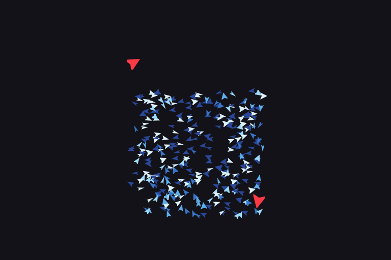
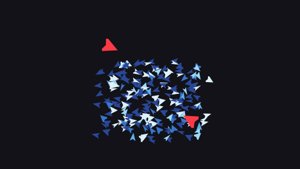
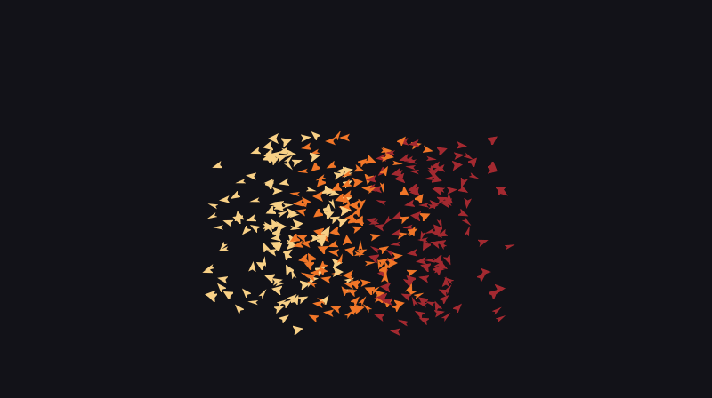
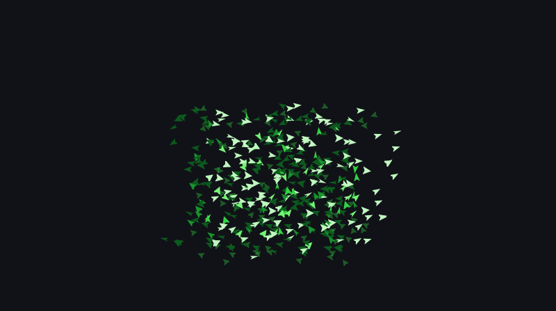
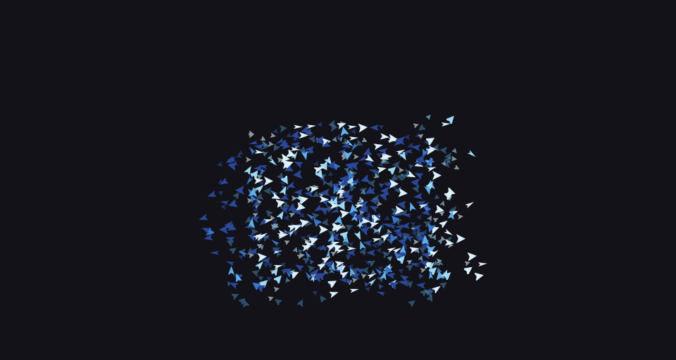
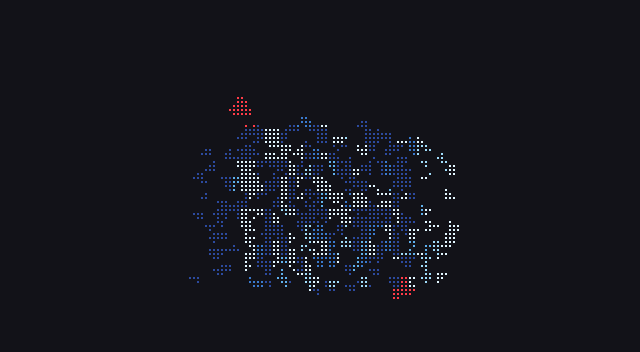
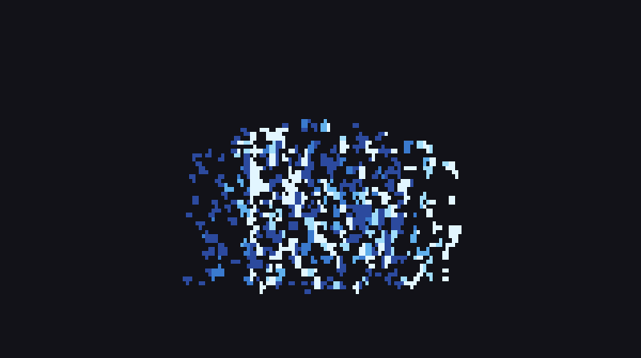

# cbirds

A flock of birds in your terminal.

<p>
<a href="https://github.com/clainstone/cbirds/actions/workflows/tests.yml"></a>
<a href="https://github.com/clainstone/cbirds/tags"></a>
<a href="LICENSE"></a>


<a href="#terminals"></a>
<a href="https://github.com/agarrharr/awesome-cli-apps#screensavers"></a>
<a href="https://github.com/rothgar/awesome-tuis#screensavers"></a>
<a href="https://github.com/fosslife/awesome-ricing#show-off-scripts"></a>
</p>

<p align="center"></p>

<p align="center"><code>cbirds --render kitty --hawks 2 --color ice --speed 0</code></p>

Craig Reynolds' boids, drawn in braille in any terminal, and as sprites over
the Kitty graphics protocol in Kitty and Ghostty. One C99 program, no
dependencies. Every clip on this page was recorded by cbirds itself.

<table>
<tr>
<td width="50%"></td>
<td width="50%"></td>
</tr>
<tr>
<td align="center"><code>cbirds --render kitty --hawks 2 --color ice --speed 0</code></td>
<td align="center"><code>cbirds --render kitty --flocks 3 --color ember</code></td>
</tr>
<tr>
<td width="50%"></td>
<td width="50%"></td>
</tr>
<tr>
<td align="center"><code>cbirds --render kitty --matrix --speed 0</code></td>
<td align="center"><code>cbirds --render kitty --depth --trails --color ice</code></td>
</tr>
<tr>
<td width="50%"></td>
<td width="50%"></td>
</tr>
<tr>
<td align="center"><code>cbirds --render braille --hawks 2 --color ice</code></td>
<td align="center"><code>cbirds --render sextants --color acid --speed 2</code></td>
</tr>
</table>

## Install

### Homebrew

macOS and Linux. Completions for bash, zsh and fish come with it, and
`brew upgrade` keeps it up to date.

<!-- test: brew-install -->
```
brew install clainstone/tap/cbirds
```

### apt

Debian 12, Ubuntu 22.04 and later, and their derivatives, on amd64 or arm64,
from its [apt repository](https://clainstone.com/apt). Completions come with
it, and `sudo apt upgrade` keeps it up to date.

<!-- test: apt-install -->
```
sudo apt install curl
curl -fsSL https://clainstone.com/apt/cbirds.gpg | sudo tee /etc/apt/keyrings/cbirds.gpg >/dev/null
echo "deb [signed-by=/etc/apt/keyrings/cbirds.gpg] https://clainstone.com/apt stable main" | sudo tee /etc/apt/sources.list.d/cbirds.list
sudo apt update
sudo apt install cbirds
```

Or just the package, without the repository and so without updates: the
`.deb` files are on the [release page](https://github.com/clainstone/cbirds/releases/latest),
for `sudo apt install ./cbirds_*.deb`.

### From source

```
git clone https://github.com/clainstone/cbirds
cd cbirds
make
sudo make install
cbirds
```

That puts one file, `/usr/local/bin/cbirds`. Without sudo, in your home
instead (`~/.local/bin` has to be on your `PATH`):

```
make install PREFIX="$HOME/.local"
```

Linux and macOS. You need a C compiler and `make`, nothing else.
`make test` runs the tests. The build uses the system's `cc` and honours `CC`,
`CFLAGS`, `LDFLAGS`, `PREFIX` and `DESTDIR`, so `make CC=clang` and packaging
work as usual.

## Uninstall

### Homebrew

The second line removes the tap as well; leave it out to keep it.

<!-- test: brew-uninstall -->
```
brew uninstall cbirds
brew untap clainstone/tap
```

### apt

The last two lines remove the repository as well; leave them out to keep it.

<!-- test: apt-uninstall -->
```
sudo apt remove cbirds
sudo rm /etc/apt/sources.list.d/cbirds.list /etc/apt/keyrings/cbirds.gpg
sudo apt update
```

A `.deb` installed on its own goes with the first line alone.

### From source

In the same directory, and with the same `PREFIX` it was installed with:

```
sudo make uninstall                     # installed with sudo make install
make uninstall PREFIX="$HOME/.local"    # installed in your home
```

Without the clone it is the one file: `sudo rm /usr/local/bin/cbirds`, or
`rm ~/.local/bin/cbirds`.

## Use

```
cbirds                              a flock in braille, in your terminal's own colours
cbirds --render kitty               sprites, in Kitty or Ghostty
cbirds --preset murmuration         the starling look
cbirds --hawks 2 --color ice        something to watch
cbirds --flocks 3 --color ember     three flocks that keep to their own
cbirds --color prism                a turn runs a rainbow through the flock
cbirds --depth --trails             a second sky behind the first
cbirds --matrix                     it is raining birds
cbirds --fireflies                  a summer night, and they fall into step
fastfetch | cbirds                  the letters of anything take flight
```

It opens by writing BOIDS, lets go, and flocks. Move the pointer into the
flock and it scatters; whip it through and a wave of light runs across the
flock, as it does when a hawk dives. Press `q` and it flies off the top. Left
alone for a minute, it starts moving the sliders itself; any key takes them
back.

`h` opens a panel of sliders in the corner, and `--panel` opens it from the
start. Lowercase lowers, uppercase raises, one press is one notch. `speed`
flies the same flock slower or faster, from a fifth of its pace to thirteen
fifths. With two flocks or more the panel grows one more row, `avoidance` on
`g`/`G`: at the bottom the flocks mix into one flock of two or three colours,
in the middle, where it starts, each keeps to its own kind and flies where it
likes, and at the top they keep well apart.

`--unlock-fps` removes the frame delay and renders as fast as the terminal accepts
frames. The simulation still advances in real time, so unlocking it does not make
the birds fly faster. It is useful for profiling; normal runs are capped at 60
fps.

```
╭────────────────────────────────────╮
│ boundary   ▓▓▓▓░░░░░░░░  0.20  b/B │
│ separation ▓▓▓▓░░░░░░░░ 0.005  s/S │
│ alignment  ▓▓▓▓░░░░░░░░  1.50  a/A │
│ turning    ▓▓▓▓▓▓▓▓░░░░   70°  t/T │
│ perception ▓▓▓▓▓▓░░░░░░  36px  p/P │
│ speed      ▓░░░░░░░░░░░  0.4×  v/V │
│ frame        0.6ms    31KB  60fps  │
│ quit       q                       │
╰────────────────────────────────────╯
```

| key | | key | |
|---|---|---|---|
| `b`/`B` `s`/`S` `a`/`A` `t`/`T` `p`/`P` `v`/`V` `g`/`G` | one notch down, one up | `h` | panel |
| `Space` | pause | `.` | one frame |
| `0` | back to the defaults | `Tab` | next preset |
| `+` `-` | more birds, fewer | `k` `K` | a hawk more, one fewer |
| `e` | tails | `q` | quit |
| `Enter` | letters off, or home | | |

## Anything can fly

Pipe text into cbirds and the text is the flock.

```
fastfetch | cbirds
figlet -f big hello | cbirds
ls --color=always -la | cbirds
git log --oneline --graph --color=always | cbirds
cbirds --text poem.txt
```

It opens with the text exactly as the command printed it, in its own colours,
laid out as a terminal would have laid it out: cbirds reads the escape
sequences, so a logo with its information beside it comes out as a logo with its
information beside it. A few seconds later one letter leaves and the ones near
it follow, a wave that crosses the screen in about a second, and the letters
fly as a flock. After twenty seconds or so they are called home, and every
letter lands on its own cell: the screen is what the command printed again, to
the cell. After a pause it happens again.

`Enter` sends the letters off, or calls them home at once. Move the pointer
through the text at rest and the letters it touches fly up, and they come back
when it has gone. `q` sends them off the top, as it does the birds.

A letter is drawn as itself, in its own colours, with its bold and underline,
wherever it is; one with no colour of its own takes the flock's while it flies.
A background colour stays where it was printed. Wide characters take two cells.
Hawks work, and are arrows over text: they scatter the letters they come near.
No wave of light runs through a text, whether a hawk dives or the pointer is
whipped; the letters have the wave that sends them up. `--birds`, `--flocks`,
`--depth`, `--matrix`, `--shape`, `--sprite`, `--size` and tails do not apply:
the text decides how many letters there are, and a letter has no sprite.
`--fireflies` does not go with text, since the text is the flock, and cbirds
says so and stops. `--render kitty` draws text too. The panel is laid over the
text, and the letters under it still land there.

When standard input is not a terminal, the keys are read from the terminal
itself. A pipe is read to its end, or until it has been quiet for a second and a
half, or has gone on for eight seconds, or has sent a megabyte, and what is kept
is the last screenful, as a terminal would keep it; `tail -f log | cbirds` shows
what the log had when it went quiet. A pipe that sends nothing for three seconds,
and text with nothing to see in it, give the ordinary flock. If the window
changes size, the text is laid out again on the new one.

Recordings take text too, and then run a whole cycle, 34 seconds, unless
`--record-seconds` says otherwise:

```
fastfetch | cbirds --record fetch.cast
cbirds --text poem.txt --record poem.gif --record-fps 20
```

A GIF of text is drawn with a 5 by 7 font in cells of 12 by 20 pixels, so it
shows the letters rather than dots. `--snapshot` takes text, and `--bench` takes
`--text` and never a pipe it happens to be in.

## Terminals

cbirds draws in braille by default, in every terminal: no terminal is guessed
at. `--render sextants` and `--render blocks` are bolder text versions;
sextants need a font from 2020 or later, blocks work everywhere. In text mode
only the cells that changed are sent, and the background is never painted, so
the flock wears your theme.

`--render kitty` draws real sprites over the Kitty graphics protocol, and is
yours to ask for: it is made for **Kitty** and **Ghostty**. In any other
terminal what it does is undefined. WezTerm, Konsole, iTerm2, Warp and Rio
answer for the protocol and then draw too few birds, the wrong ones or none,
and inside tmux the sprites never reach the terminal.

If braille does not look right in your terminal, open an issue and say which
terminal it is. That is the report that helps most.

## Options

```
Flock
  -n, --birds COUNT             how many birds (default 800)
  -s, --size PIXELS             sprite size in pixels (default 30)
  -g, --flocks COUNT            flocks that keep to their own kind (default 1)
  -k, --hawks COUNT             predators hunting the flock (default 0)
      --preset NAME             murmuration, swarm, storm
      --seed N                  the same seed gives the same flock

Sliders   0 to 12, as the panel shows them
      --boundary NOTCH          how hard the edges push back (default 4)
      --separation NOTCH        how much a bird keeps its distance (default 4)
      --alignment NOTCH         how much a bird matches its neighbours (default 4)
      --turning NOTCH           sharpest turn a frame, 12 is instant (default 8)
      --perception PIXELS       how far a bird sees, 12 to 60 (default 36)
      --speed NOTCH             how fast the flock flies, 0.2x to 2.6x (default 1, 0.4x)
      --avoidance NOTCH         how much flocks keep out of each other's way (default 4)

Look
  -c, --color RAMP              theme, ember, ice, acid, matrix, aurora, prism, potion, dusk, ash, firefly
      --shape NAME              bird, arrow, plane, dot
      --sprite FILE             a PNG you supply, kept in its own colours
  -e, --trails                  faint tails behind the flock
      --depth                   a second sky further off: smaller, slower, dimmer birds
  -l, --panel                   the sliders in the corner from the start; h toggles them
      --render HOW              braille by default; sextants, blocks, or kitty in Kitty and Ghostty

Oddities
      --matrix                  it is raining birds
      --fireflies               a summer night; they fall into step
      --text FILE               a file whose letters take flight; text piped in does the same

Output
      --bench N                 run N frames with no terminal, print the numbers, quit
      --frames N                quit after N frames, for recording
      --snapshot FILE           write the last frame as a PNG
      --record FILE             record a GIF, or a .cast for asciinema, with no terminal, and quit
      --record-fps RATE         frames a second; a GIF can carry up to 50 (default 25)
      --record-seconds SECONDS  how long the recording runs (default 6, 34 for text)
      --record-size COLSxROWS   the size to record at, in cells (default 96x26)

General
      --unlock-fps              render as fast as the terminal allows
  -h, --help                    the one-screen help
      --completion SHELL        completions for bash, zsh or fish
  -V, --version                 print the version and quit
```

That is the options part of `cbirds --help`, as it prints it; the full help
adds usage, examples and the keys.

`--sprite` takes any PNG up to 4 MB: palette, grayscale, RGB or RGBA, at any bit
depth, interlaced or not. `--seed` is the same flock on every system: the random
numbers are cbirds' own, not the C library's.

## Recording

```
cbirds --record flock.gif --hawks 2 --seed 5
cbirds --record flock.cast --record-fps 30
cbirds --snapshot frame.png --frames 400
```

`--record` needs no terminal: it runs the flock headless and writes the GIF
with its own encoder. If the file name ends in `.cast` you get an
[asciinema](https://asciinema.org) recording instead, which plays in any
terminal and is about half the size. A GIF is drawn with sprites unless
`--render braille` or `--render sextants` asks for the cells, as a text
terminal would show them. `--snapshot` saves a live frame as a PNG, so it wants a
terminal. The commands behind every clip here are in
[docs/README.md](docs/README.md).

## How it works

The bird is one PNG compiled into the binary. At startup it is rotated into
sixty headings, squashed into three wing positions, and tinted into every
shade on the ramp: about fifteen hundred small images, built in a fifth of a
second. They are sampled down into braille, sextants or blocks, or, with
`--render kitty`, uploaded once, and a frame is then one short command per
bird. The wings beat six times a second, and now and then
a bird glides.

Neighbours are found with a grid, so eight hundred birds cost about half a
millisecond of CPU a frame, and four thousand birds about four milliseconds.
The PNG, GIF and DEFLATE code is all in the repository; there is no
zlib, no libpng, no ncurses. `cbirds --bench 300` prints the numbers on your
machine.

## The algorithm

Each bird sees only its neighbours and follows three rules: keep your
distance, fly the way they fly, drift towards their middle. Add a nudge away
from the edges of the screen, sum the four pulls, and turn towards the result,
but only so far in one frame. That limit is what gives the flock curved fronts
instead of a cloud snapping into shape. Repeat sixty times a second and a
murmuration falls out of it; nothing in the code knows what a flock looks
like. Reynolds' paper, below, has the rest.

A hawk is not a boid. It follows one rule, chase the nearest bird, and every
bird flees it. When it dives, the birds in its way swerve, and the birds that
see them swerve do the same a moment later and in the same way, so the turn
crosses the flock as a wave, about three times as fast as a bird flies. A bird
is drawn lit while it swerves, and does not swerve again for three seconds,
which is what lets the wave pass through the flock and not come back through it.

## Fireflies

`--fireflies` is a summer night. The birds become fireflies that drift in the dark,
each flashing to a clock of its own: a second long, and a few percent off its
neighbours'. Nothing is in charge. A firefly that sees a flash moves its own clock
forward a little, more the nearer it is to its own flash, and one that is pushed
past the end flashes at once. From a random start the swarm falls into step in
about half a minute: patches first, then waves of light rolling across the
screen, then the whole night flashing and going dark together.

A flash is seen a long way, but not everywhere, which is why synchrony grows in
patches and not all at once. The reach is counted in the distance between
fireflies, so a small window and a large screen tell the same story. The pointer
is a lantern: the fireflies it is held over are startled and their clocks
thrown, and the swarm heals when it moves on. Whipped through the swarm it starts
no wave of light; that is for a flock under a hawk.

The panel keeps working. `alignment` becomes `coupling`, how far a flash moves a
clock, and `perception` becomes `sight`, how far a flash is seen; `--alignment`
and `--perception` set them. A `sync` row reads out how much of the swarm is in
step, from 0 to 1. Hawks, flocks, presets and tails have nothing to do on a
night, and the program says so; text is refused, since a night has its own
flock. A flash is the
pale yellow of the `firefly` ramp, dying through yellow green to dark green over
half a second, and between flashes each firefly is a faint dot; `--birds`,
`--size`, `--shape` and `--color` still work.

## Credits

The model is from Craig Reynolds' *Flocks, Herds, and Schools: A Distributed
Behavioral Model*, SIGGRAPH 1987; his page on boids is at
[red3d.com/cwr/boids](https://www.red3d.com/cwr/boids/). The Kitty graphics
protocol is documented at
[sw.kovidgoyal.net/kitty/graphics-protocol](https://sw.kovidgoyal.net/kitty/graphics-protocol/).
The escape waves are after what is seen in starling flocks attacked by falcons:
Procaccini and others, *Propagating waves in starling, Sturnus vulgaris, flocks
under predation* (Animal Behaviour, 2011), and Storms and others, *Complex
patterns of collective escape in starling flocks under predation* (Behavioral
Ecology and Sociobiology, 2019).

The fireflies are from Mirollo and Strogatz, *Synchronization of pulse-coupled
biological oscillators*, SIAM Journal on Applied Mathematics, 1990. The biology
is Buck's, in *Synchronous Rhythmic Flashing of Fireflies. II*, Quarterly Review
of Biology, 1988.

## License

MIT. See [LICENSE](LICENSE).
